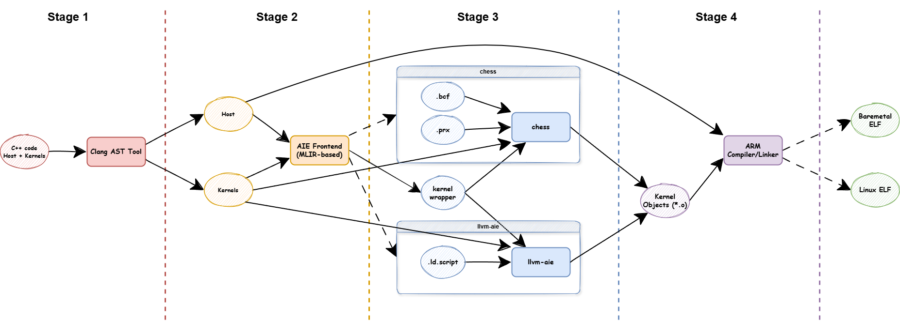

# AIEHLC

App Writing and Deployment Tutorial: [tutorial.md](tutorial/tutorial.md)

## What is the aiehlc?

AIEHLC(AIE high‑level compiler) is a lightweight, efficient high level compilation integration solution for AIE (AI Engine) applications on Versal AI Core Series. It integrates with pre-built hardware designs (PDI) to effectively decouple hardware and software application development, providing a comprehensive end-to-end deployment solution.

Key features:

> Integrate and Support the [Synopsys](https://www.synopsys.com/) chess compiler (from the [Vitis](https://www.amd.com/en/products/software/adaptive-socs-and-fpgas/vitis.html) package) for kernel code compilation

> It Also Integrate and Supports the opensource [LLVM-AIE](https://github.com/Xilinx/llvm-aie) compiler solution for kernel compilation

> Simplifies the AIE application development learning curve for rapid prototyping


AIEHLC empowers users to develop straightforward AIE applications using only the AIE driver C API, eliminating the need to learn additional domain-specific languages (DSLs). This streamlined approach target to accelerates the development process and reduces barriers to entry for AIE application development.

### Architecture



### What it is Not

1. It serves as a complementary solution and is not intended to replace the official AIE software application compilation tools.
2. It focuses solely on software compilation and does not function as a hardware design compilation tool.
3. It currently supports only Versal AI Core Series devices and does not provide compatibility with Ryzen AI SOCs.

### What are the Limitations

Its primary goal is to help system engineers simplify the learning curve for AIE application development and enable quick prototyping. As a result, it may not be as feature-complete as the official tools available.

### What are the Trade-Offs

1. The pre-built PDI (hardware design) supports only GMIO interfaces. For PLIO (FPGA) support, users must implement a customized hardware design with the appropriate PLIO logic components.

2. The pre-built hardware design (PDI) delivers adequate performance for most applications. However, for use cases requiring optimal Network-on-Chip (NOC) performance, the official Vitis hardware/software tools are recommended.

3. Users must configure routing at runtime. For Ahead-of-Time (AOT) routing support, it is recommended to utilize Vitis or AIECompiler tools instead.


## Examples

```bash
source script/setup.sh
#or
source ./script/setup.sh --bsp-use-git-repo=https://path/to/aie-rt.git

source script/aiehlc.sh --runtime-source-file example/perf/aieml_perf.cc 
```

Using llvm-aie (experimental):

```bash
source script/setup.sh
#or
source ./script/setup.sh --bsp-use-git-repo=https://path/to/aie-rt.git

source script/aiehlc.sh --use-llvm-aie --runtime-source-file example/other/multikernel.cc
```

AIE2PS Compilation Support

```bash
source script/setup.sh
#or
source ./script/setup.sh --bsp-use-git-repo=https://path/to/aie-rt.git

source script/aiehlc.sh --aie-version 5 --runtime-source-file example/perf/aieml_perf.cc
```

PetaLinux Support

```bash
source script/setup.sh
#or
source ./script/setup.sh --bsp-use-git-repo=https://path/to/aie-rt.git

source script/aiehlc.sh --platform linux --aie-version 2 --runtime-source-file tutorial/example.cpp
```

## Compiling aiehlc (Optional)

Building aiehlc is only necessary if you intend to develop or compile aiehlc itself. If your aim is simply to use aiehlc, this step is not required.

Build Tutorial: [build.md](doc/build.md)

<p align="center">Copyright&copy; 2025 Advanced Micro Devices, Inc</p>
