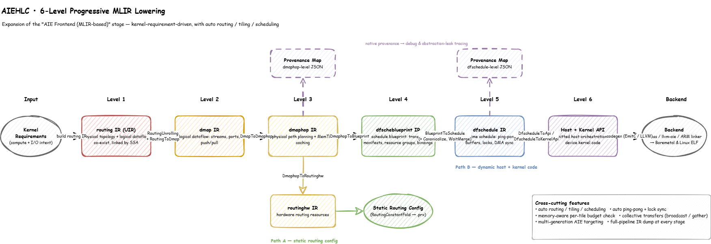
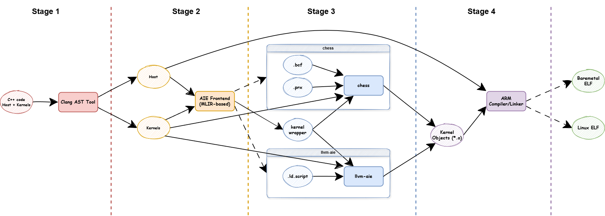

# AIEHLC

App Writing and Deployment Tutorial: [tutorial.md](tutorial/tutorial.md)

## What is the aiehlc?

AIEHLC (AIE High‑Level Compiler) is an LLVM & MLIR-based, lightweight, and efficient high-level
compiler tailored for AIE (AI Engine) applications on the Versal AI Core Series. By leveraging spatial types and policies declared within the kernel code, the compiler automatically generates routing, tiling, and scheduling logic, eliminating the need to manually construct spatial compute graph connections.

Furthermore, the compiler features a high-level runtime that wraps the AIE driver API, ensuring seamless interoperability with CUDA/ROCm-compatible API use cases. This runtime solution integrates with bare-metal platforms to support direct ELF deployment on bare-metal hardware such as APUs and RPUs. It also co-operates with pre-built hardware designs (PDIs) to effectively decouple hardware and software application development, ultimately delivering a comprehensive, end-to-end deployment solution.

Key features:

> **Simplifies** the AIE application development learning curve for AIE development

> **Native provenance mapping** for easier debugging and handling abstraction leaks.

> **Kernel-requirement-driven** programming with automatic routing, tiling, and scheduling.

> **Automatic ping-pong** buffering and lock synchronization, overlaps DMA and compute without manual effort.

> **Memory-aware auto scheduling**, validates per-tile buffer budgets at compile time, catching capacity violations before they reach hardware.

> **Collective transfer primitives**, — built-in one-to-many broadcast and many-to-one gather for efficient multi-tile data distribution.

> **Six-level progressive MLIR lowering**, letting developers tune at whichever abstraction layer matches their expertise.


AIEHLC enables developers to easily build AIE applications by relying solely on the AIE driver C API and CUDA/ROCm-compatible APIs, eliminating the need to learn additional domain-specific languages (DSLs). This streamlined approach target to accelerates the development process and reduces barriers to entry for AIE application development.

### Emaple code conv2d

```c
//kernel code 
constexpr aie::GlobalPolicy conv_policy = {.fullconnect_auto = 0};
__global__(conv_policy) void conv2d_spatial(
    aie::port<input_window_int8 *, RowBC_spatial> win_a, // raw slab [halo_slice, W*C] (derived)
    aie::port<input_window_int8 *, ColBC> win_b,         // filter [K, tile_N]
    aie::port<output_window_int8 *, LtoR_Merge> win_c    // output [oh_per_row*OW, tile_N]
) {
   .....
}

//host code 
int main() {
    //...
    aieSetDevice(0);
    aieArray device;
    aieMesh mesh = device.partition({3, 6, 0, 6}, HW_ROWS, HW_COLS);
    //...
    conv2d_spatial<<<mesh>>>(input, filter, output, M, N, K);
    //...
}
```

### Architecture





### What it is Not

1. It is not a VLIW processor compiler; instead, it relies on Synopsys or llvm-aie to provide processor-level support.
2. It focuses solely on software compilation and does not function as a hardware design compilation tool.
3. It currently supports only Versal AI Core Series devices and does not provide compatibility with Ryzen AI SOCs.

### What are the Limitations

Currently only support GMIO and no PLIO support yet.

### What are the Trade-Offs

1. The pre-built PDI (hardware design) supports only GMIO interfaces. For PLIO (FPGA) support, users must implement a customized hardware design with the appropriate PLIO logic components.

2. The primary programming language is C. However, users who wish to perform low-level tuning can interact directly with the MLIR programming layer.

## Examples

```bash
source script/setup.sh
#or
source ./script/setup.sh --bsp-use-git-repo=https://path/to/aie-rt.git

source script/aiehlc.sh --runtime-source-file example/perf/aieml_perf.cc 
```

Using llvm-aie (experimental):

```bash
source script/setup.sh
#or
source ./script/setup.sh --bsp-use-git-repo=https://path/to/aie-rt.git

source script/aiehlc.sh --use-llvm-aie --runtime-source-file example/other/multikernel.cc
```

AIE2PS Compilation Support

```bash
source script/setup.sh
#or
source ./script/setup.sh --bsp-use-git-repo=https://path/to/aie-rt.git

source script/aiehlc.sh --aie-version 5 --runtime-source-file example/perf/aieml_perf.cc
```

PetaLinux Support

```bash
source script/setup.sh
#or
source ./script/setup.sh --bsp-use-git-repo=https://path/to/aie-rt.git

source script/aiehlc.sh --platform linux --aie-version 2 --runtime-source-file tutorial/example.cpp
```

AIE Simulator Support (no board required)

Select the simulator with `--platform sim`. Key args:

- `--aie-version`: `1` (AIE), `2` (AIE-ML), or `5` (AIE2PS)
- `--sim-tiles "col:row,..."`: tiles to load a stub kernel ELF onto (comma-separated logical-`col`:physical-`row`, e.g. `0:3`). Omit to stub the whole array (default, but seems to crash the simulator often).

```bash
source script/setup.sh
#or
source ./script/setup.sh --bsp-use-git-repo=https://path/to/aie-rt.git

# Step 1: generate artifacts + aout/sim_config.sh (no auto-run)
source script/aiehlc.sh --platform sim --aie-version 5 --runtime-source-file tutorial/example.cpp

# Step 2: run the simulator against the generated aout/ dir
bash script/runsim.sh aout/

# stub only tile col=0 row=3 (config records the stub choice; runsim reads it)
source script/aiehlc.sh --platform sim --aie-version 5 --sim-tiles "0:3" --runtime-source-file tutorial/example.cpp
bash script/runsim.sh
```

`runsim.sh` can be invoked three ways:

```bash
# 1. Default: no args -> reads ./aout/sim_config.sh (same CWD you ran aiehlc.sh from)
bash script/runsim.sh

# 2. Specific aout dir: point it at any aout/ containing a sim_config.sh
bash script/runsim.sh path/to/aout

# 3. Direct (no config file): pass the inputs yourself (not recommended)
bash script/runsim.sh \
    --host-src /path/to/host.cc \
    --kernel-objs "/path/k1.o /path/k2.o" \
    --kernel-names "k1 k2" \
    --aie-gen 5 \
    --stub-all            # or: --stub-tiles "0:3"
```

On success the sim ends with `Sucess: CPU result matches AIE.` / `Sim result: 0`.

## rcom: ROCm/HIP GEMM Front End

`rcom` is a standalone Python front end that reads a canonical ROCm/HIP int8
GEMM source, recognizes it as a GEMM, and emits a CUDA-style `<name>.cc/.h`
(the same dialect as `example/tileprogram/ccode/simplematmul2.cc`). It then
hands the generated `.cc` to the unchanged `script/aiehlc.sh` pipeline to build
host + kernel ELFs.

```
matmul_hip.cpp --(rcom.py)--> <name>.cc + <name>.h --(aiehlc.sh)--> aout/main.elf
```

The HIP kernel body is *recognized and templated* (the proven AIE cache-A /
stream-B matmul), not translated line-for-line. v1 supports **int8 only** and
defaults to the HW-validated `M=N=K=256`, `4x4` mesh config; `M/N/K` and mesh
are overridable but deviations are heuristic (untested on HW) and emit a
warning.

```bash
source script/setup.sh

# One-shot: HIP source -> generated .cc/.h -> ELF (aout/main.elf)
source script/rcom.sh --rocm-source-file example/tileprogram/rocm/matmul_hip.cpp --aie-version 5

# Emit only (no build), e.g. for inspection:
python3 src/tool/frontend/rcom.py example/tileprogram/rocm/matmul_hip.cpp \
    --emit-only --out ./gen

# Overrides: kernel name, mesh, dims
python3 src/tool/frontend/rcom.py example/tileprogram/rocm/matmul_hip.cpp \
    --name gemm --mesh 4x4 --M 256 --N 256 --K 256 --out ./gen
```

## Runtime Debug Level

Control runtime diagnostic verbosity and feature flags from your source file using `#pragma aie_debug_level`:

```cpp
#pragma aie_debug_level 2

__global__ void mykernel(const int32_t *A, int32_t *B) {
    // kernel code
}

int main() {
    // host code
}
```

The debug level value is a bitfield:
- **Bits 0-3**: verbosity level (0-15)
- **Bits 4-31**: feature flags

### Verbosity Levels (bits 0-3)

| Level | Behavior |
|-------|----------|
| `0` | Silent (default when pragma is absent) |
| `1` | BD tracking and IO logs |
| `2` | Full diagnostics: DMA address log, write pattern, readback |

### Feature Flags (bits 4+)

| Flag | Bit | Value | Behavior |
|------|-----|-------|----------|
| `DISABLE_MULTID_DIM_DMA` | 4 | `16` | Suppress multi-dimensional DMA; force linear `__Runtime_dma_bd_config` |
| `DISABLE_PARTITIONTEARDOWN` | 5 | `32` | Skip `XAie_PartitionTeardown` in `__Runtime_device_teardown` |
| `AIE_DMA_ISSUE_COUNT` | 7 | `128` | Use `XAie_PartitionInitialize_v2`/`_v2` teardown to arm DMA txn perf counters (whole partition, MM2S ch0) |

### Examples

| Pragma Value | Verbosity | Flags | Effect |
|-------------|-----------|-------|--------|
| `0` | 0 | none | Silent, multi-dim DMA enabled |
| `1` | 1 | none | BD tracking, multi-dim DMA enabled |
| `2` | 2 | none | Full diagnostics, multi-dim DMA enabled |
| `16` | 0 | `DISABLE_MULTID_DIM_DMA` | Silent, multi-dim DMA suppressed |
| `18` | 2 | `DISABLE_MULTID_DIM_DMA` | Full diagnostics + multi-dim DMA suppressed |
| `128` | 0 | `AIE_DMA_ISSUE_COUNT` | Silent, DMA txn counters armed via `PartitionInitialize_v2` (MM2S ch0) |

The pragma is detected during preprocessing and emits a strong symbol override of `g_runtime_debug_level` into the generated `host.cc`. The runtime in `aie_runtime.c` defines this variable as a weak symbol with default `0`, so the linker picks the user-specified value when present.

This works for both single-tile (`aiehlc`) and multi-tile (`tilinglinalg`) compilation paths.

## Debug Tools

### aiediag — Flow-Aware DMA Diagnostic

`aiediag` (`src/tool/debug/aiediag.py`) is a post-deployment diagnostic tool for debugging DMA stalls and data flow issues on live AIE hardware. It reads DMA status registers via `aiedbg`, cross-references them with compile-time provenance JSONs to identify connected tiles and routing paths, and prints an automated diagnosis.

#### When to Use

- A DMA channel is stuck (stream starvation, backpressure, lock stall)
- Output data is missing or incomplete after a HW run
- You need to determine whether `start_io` was actually issued on a shim tile
- You want to trace a data flow from shim through core tiles and identify where it stalls

#### Usage

```bash
# Basic: diagnose MM2S ch0 on logical tile (1,4) with startcol offset 3
python3 src/tool/debug/aiediag.py dig 1 4 -mm2s0 startcol 3 -dev pal

# Dry-run (no HW access, prints what would be read)
python3 src/tool/debug/aiediag.py dig 1 4 -mm2s0 startcol 3 --dry-run

# Specify AIE version and custom JSON directory
python3 src/tool/debug/aiediag.py dig 0 3 -s2mm1 --aie-version 2ps --json-dir ./my_worklocal

# Custom shim events JSON location
python3 src/tool/debug/aiediag.py dig 0 0 -mm2s0 --shim-events-json /path/to/shimtile_events.json -dev pal
```

#### Arguments

| Argument | Description |
|----------|-------------|
| `COL` | Logical column (from IR/JSON, 0-based) |
| `ROW` | Physical row (0=shim, 1=memtile, 3-6=core for AIEML) |
| `-mm2s0`, `-s2mm1`, etc. | Direction and channel number |
| `startcol N` | Physical column offset; physical_col = COL + startcol |
| `--aie-version` | `5` (AIEML, default) or `2ps` |
| `-dev`, `--device` | Device type passed to aiedbg (e.g., `pal`) |
| `--target` | Target passed to aiedbg (e.g., `baremetal://192.168.0.1:9999`) |
| `--json-dir` | Directory containing provenance JSON files |
| `--shim-events-json` | Path to `shimtile_events.json` (default: `~/aiejson/shimtile_events.json`) |
| `--dry-run` | Print aiedbg commands without executing |

#### Diagnostic Steps

The tool runs 7 steps in sequence:

1. **DMA Status** — Read the queried tile's DMA status register (running/idle/stalled, stall cause, current BD, queue size). For core tiles (row != 0), also decode memory-module DMA start/finish/error events for all 4 channels and any active core-module error events.
2. **BD Chain** — Show the buffer descriptor chain from JSON (BD IDs, lengths, locks, ping-pong, packet IDs, repeat count), the total intended data volume (sum of BD lengths × repeat), and an intended-vs-real comparison of each BD's `Buffer_Length` read back from hardware (`OK` / `MISMATCH` / `hw not configured`)
3. **Connected Tiles** — Use the flow summary to find all senders/receivers in the same data flow
4. **Connected Tile DMA Status** — Read DMA status registers of all connected tiles
4b. **Shim Event Status** — For shim tiles (row=0), read hardware event status registers to determine whether DMA start/finish/stall events have fired
5. **Connected Tile BD Chains** — Show BD chains of connected tiles
6. **Routing Path** — Show the physical routing hops from dmaphop provenance map
7. **Diagnosis** — Automated root-cause analysis combining all data sources

#### Prerequisites

##### aiedbg

`aiedbg` must be in `PATH`. It is the Xilinx/AMD AIE debug CLI that reads/writes AIE tile registers over JTAG or network. It is part of the Vitis installation (`$XILINX_VITIS/bin/aiedbg`) or can be installed separately.

The tool invokes it as:
```
aiedbg [--target TARGET] [--device DEVICE] reg read PHYS_COL ROW 0xOFFSET
```

##### Provenance Map JSONs

These JSON files are generated by the tilinglinalg compilation pipeline and describe the compiled data flow. The tool auto-searches these directories (in order):

1. `./worklocal/`
2. `./aout/worklocal/`
3. `./src/mlir/mlirfront/tilinglinalg/pass/unitest/build/worklocal/`
4. `./src/mlir/mlirfront/tilinglinalg/pass/unitest/worklocal/`

Or use `--json-dir` to specify explicitly.

**`dfscheduleprovenancemap.json`** — Generated by `DfscheduleToApiPass` / `DfscheduleToKernelApiPass`. Contains:
- `tiles[]` — Every tile with its DMA channels, BD chains (bd_id, buffer_offset, len, locks, packet_id, next_bd, dim_strides, iter_wrap), start_io repeat counts, and contracts
- `flow_summary[]` — Each data flow with its participants (tile_col, tile_row, io_direction, channel, repeat_count, bd_len)

**`dmaphopprovenacemap.json`** (or `provenance_map.json`) — Generated by `DmaphopTodfscheblueprintPass`. Contains:
- `communication_paths[]` — Each path with producer/consumer tiles, physical hop chain, tensor shape, partition info, and port symbols

##### shimtile_events.json

Default location: **`~/aiejson/shimtile_events.json`**

This file maps hardware event IDs to human-readable names for the shim tile PL module. It is derived from the AIE driver source (`aie_runtime_debug.c :: s_pl_evt_names`). The file structure:

```json
{
  "module": "PL",
  "description": "Shim tile (PL module) events ...",
  "source": "aie_runtime_debug.c :: s_pl_evt_names[117]",
  "max_id": 116,
  "events": {
    "0": "NONE",
    "14": "DMA_S2MM_0_START_TASK",
    "15": "DMA_S2MM_1_START_TASK",
    "16": "DMA_MM2S_0_START_TASK",
    "17": "DMA_MM2S_1_START_TASK",
    "18": "DMA_S2MM_0_FINISHED_TASK",
    "19": "DMA_S2MM_1_FINISHED_TASK",
    "...": "..."
  }
}
```

Key DMA event IDs used by aiediag (all in the shim PL event status registers at `0x34200`-`0x34204`):

| Event ID | Name | What It Means |
|----------|------|---------------|
| 14-17 | `DMA_*_START_TASK` | DMA channel was started (start_io was issued) |
| 18-21 | `DMA_*_FINISHED_TASK` | DMA channel completed all programmed transfers |
| 22-25 | `DMA_*_STALLED_LOCK` | DMA stalled waiting for lock |
| 26-27 | `DMA_S2MM_*_STREAM_STARVATION` | S2MM has no data arriving from stream |
| 28-29 | `DMA_MM2S_*_STREAM_BACKPRESSURE` | MM2S cannot push data (downstream full) |
| 30-33 | `DMA_*_MEMORY_*` | Memory-side stall (backpressure or starvation) |

The `~/aiejson/` directory also contains event JSONs for other tile types (`core_events.json`, `memtile_events.json`) and register address maps (`aie2ps*.json`). If `shimtile_events.json` is missing, aiediag prints a warning and skips the shim event check; all other diagnostic steps still run.

### schedule_debug_server — Live Schedule View + Debug/Test Daemon

`schedule_debug_server` (`src/tool/debug/schedule_debug_server.py`) is a
zero-dependency local daemon (stdlib `http.server`, bound to `127.0.0.1`) that turns
the static `host_schedule.html` schedule view into a live debug/test console. It serves
the enhanced HTML, exposes JSON endpoints, imports `aiediag.py` as a library for register
offsets/decoders/provenance, and orchestrates `apppaltest.py`. Design rationale:
[doc/design/live_debug_framework.md](doc/design/live_debug_framework.md).

It lets you, from a single browser page:

1. **Run the test** — deploy the compiled ELF via `apppaltest.py -nonreboot` and watch the
   console + pass/fail/hang verdict.
2. **Live overlay** — poll each tile's **DMA / core / event** status and colorize the grid
   in near real time (switchable tabs, ~2s interval).
3. **Per-tile console** — click a tile and issue whitelisted read-only ops
   (`dma`, `core`, `event`, `pc`, `reg <off>`) to inspect its registers.

When the daemon is not running, opening `host_schedule.html` from disk still works — it
degrades gracefully to the static offline schedule view (live controls become inert).

#### Quickest path: `--prettydebug`

Add `--prettydebug` to the tiling build and the server launches automatically (and opens
your browser) once the schedule view is generated:

```bash
source script/aiehlc.sh --aie-version 5 \
  --runtime-source-file ./example/tileprogram/ccode/simplematmul.cc --prettydebug
```

This runs the full flow, then serves `aout/worklocal/host_schedule.html` live. Ctrl-C
stops the server.

#### Manual launch

```bash
# Live reads (grid overlay + per-tile /cmd) need a JTAG target. Set it once:
export AIEDBG_TARGET=xsdb://10.23.224.213:3121   # or pass --target below

# Serve an existing worklocal (must contain host_schedule.html + provenance JSONs)
python3 src/tool/debug/schedule_debug_server.py aout/worklocal --open

# Point at a specific ELF and shim startcol offset
python3 src/tool/debug/schedule_debug_server.py aout/worklocal \
  --elf aout/main.elf --startcol 3 --aie-version 5 --device pal --port 8091
```

#### Arguments

| Argument | Description |
|----------|-------------|
| `workdir` | Dir with `host_schedule.html` + `schedule_view.json` + provenance JSONs (default `aout/worklocal`) |
| `--elf` | ELF to deploy via the Run button (default `<workdir>/../main.elf`) |
| `--port` | HTTP port (default `8091`) |
| `--aie-version` | Register offset set: `5` (AIEML, default) or `2ps` |
| `--device` | `aiedbg --device` (default `pal`) |
| `--target` | `aiedbg --target` (e.g. `xsdb://10.23.224.213:3121`); resolution order: `--target` → `$AIEDBG_TARGET` → `~/.aiedbg_env` (the file `aiedbg-setup` writes). Without any, live grid/`/cmd` reads fail with "timed out" / "connection closed" |
| `--startcol` | Physical column offset: `phys_col = col + startcol` |
| `--apppaltest` | Path to `apppaltest.py` (default `script/test/apppaltest.py`) |
| `--open` | Open the served URL in a browser after binding |

#### Endpoints

| Method | Path | Purpose |
|--------|------|---------|
| `GET` | `/` | Serves the enhanced `host_schedule.html` |
| `GET` | `/schedule_view.json` | The static `DATA` blob |
| `POST` | `/run` | Spawn the board test `-y -nonreboot <elf>` (`-u` unbuffered) → `applog`. Body `{device, board_host}`: `palmyra` → `apppaltest.py` (inherit env); `vek385` → `appvek385.py` with env `USERNAME=getpass.getuser()` + `VEK385IP=<board_host>` (host required) |
| `POST` | `/stop` | Force-kill the running test's process group (SIGTERM→SIGKILL); appends a `[force-stop]` line to `applog` |
| `GET` | `/applog?offset=N` | Realtime tail of the `applog` file → `{data, next, running, status}`; poll stops on `running=false` (process exit), not on derived `pass\|fail` |
| `GET` | `/ping?device=&host=` | Connection test → `{ok, aiedbg, target, detail}`. Confirms `aiedbg` is in PATH **and** the resolved JTAG target actually answers (one read-only register read on the first schedule tile). Drives the UI's "Test connect" gating |
| `GET` | `/grid?what=dma\|cores\|events&device=&host=` | Whole-array status survey for the overlay; `device`/`host` pick the aiedbg target (`palmyra` → `xsdb://$PALIP:3121`, `vek385` → `xsdb://<host>:3121`) |
| `POST` | `/cmd` | Whitelisted op (`dma`/`core`/`event`/`pc`/`reg`/`chans`/`chanevent`); body may carry `device`/`host` for device-aware target. `chans` lists a tile's channels + coarse live DMA state; `chanevent` (needs `dir_ch`) decodes per-channel start/finish/(stall/error) events → `{events, summary}` |

The browser UI has a **Board selector** (`palmyra` / `vek385`). Selecting a device
enables a **"Test connect"** button (and, for `vek385`, reveals a board-hostname
text box). Clicking **Test connect** hits `/ping`; only on a passing test does the
"Live status overlay" checkbox unlock **and** the drill-down console appear. The
"Run test" button (spawns `apppaltest`) is enabled as soon as a device is chosen.

The right panel has a **drill-down command console** (pinned bottom, revealed after
a passing connection test): clicking a tile sets it as the console TARGET and
auto-lists its channels; clicking a channel narrows the target to that channel,
after which `status` (DMA status) and `event` (per-channel DMA events) operate on
it. Commands: `channels | status | event | core | pc | reg <off>`. The console
persists while the overlay checkbox is toggled off (it is tied to the connection,
not the overlay), and is hidden again when the device changes or the connection
test fails.

#### Safety

- Binds `127.0.0.1` only; `/cmd` uses an op **whitelist** (no arbitrary shell; `reg` offset
  parsed as an integer).
- Issues **read-only** register reads only (never `stop`/`con`/writes), so it cannot perturb
  a running target sharing the same JTAG bridge.
- Reuses aiediag's `--json` `value_hex` parsing (avoids the offset-as-value Pitfall). If
  `aiedbg` is not in `PATH`, live reads are disabled and endpoints report `unreachable`
  rather than fake zeros.

## Enable realtime debug with --prettydebug flag

```
source script/aiehlc.sh --prettydebug  --aie-version 5 --runtime-source-file ./example/tileprogram/ccode/simpleconv2d.cc
```
## Compiling aiehlc (Optional)

Building aiehlc is only necessary if you intend to develop or compile aiehlc itself. If your aim is simply to use aiehlc, this step is not required.

Build Tutorial: [build.md](doc/build.md)

## Contributing

If you plan to contibute code then make sure you set up the clang-format pre-commit hook.

```bash
source script/precommitsetup.sh
```

## License

This project is licensed under the Apache License, Version 2.0. See [LICENSE](LICENSE) for details.

<p align="center">Copyright&copy; 2025-2026 Advanced Micro Devices, Inc.</p>
