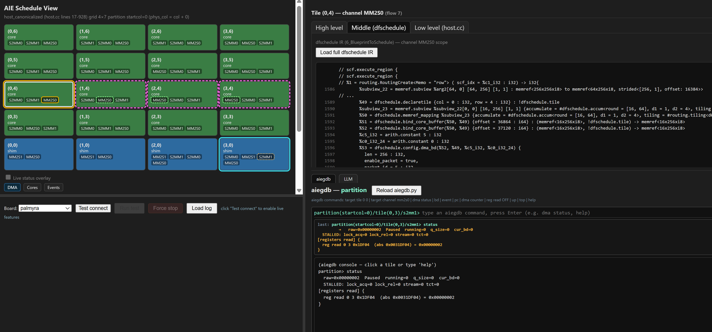

# Debug UI Tutorial — aiehlc Flow

## 1. Compile

```bash
source script/aiehlc.sh \
  --aie-version 5 \
  --runtime-source-file ./example/tileprogram/ccode/simplematmul2.cc \
  --debug-syms
```

`--debug-syms` adds `-g` and skips `strip` so the UI can resolve PC addresses to source lines. Output lands in `aout/worklocal/`.

## 2. Configure board

```bash
cp script/test/envtemplate.sh script/test/envlocal.sh
# Set USERNAME, and VEK385IP in envlocal.sh, then:
source script/test/envlocal.sh
```

## 3. Open the UI

**Via aiehlc.sh** (rebuilds then opens):
```bash
source script/aiehlc.sh ... --prettydebug
```

**Via daemon directly** (after an existing build):
```bash
python3 src/tool/debug/schedule_debug_server.py --open --no-password
```

## 4. UI basics



Four panes: **AIE Debug** (top-left, tile grid/map), **Run** (bottom-left, run controls and applog), **Info** (top-right, per-tile detail), **Tools** (bottom-right, aiegdb console and LLM).

**Run the app:** Click **Connect** to verify the JTAG link, then **Run test** to deploy and run. The applog streams live in the Run pane. Use **Force stop** if needed.

**Read tile state:** Pick **DMA**, **Cores**, or **Events** in the toolbar, then **Scan** for a one-shot register read overlaid on the grid. Toggle **live** for continuous polling. Click any tile for BD, lock, and kernel detail in the **Info** pane.

**Source viewer:** Click any `file:line` reference in the Info pane or LLM chat to open a highlighted source panel. With `--debug-syms`, the Targets card in the Info pane shows the APU backtrace with resolved function names and source locations.

**LLM tab:** Open **Tools → LLM**. Ask questions about stalls or routing; attach tile info or aiegdb output as inline context chips.
