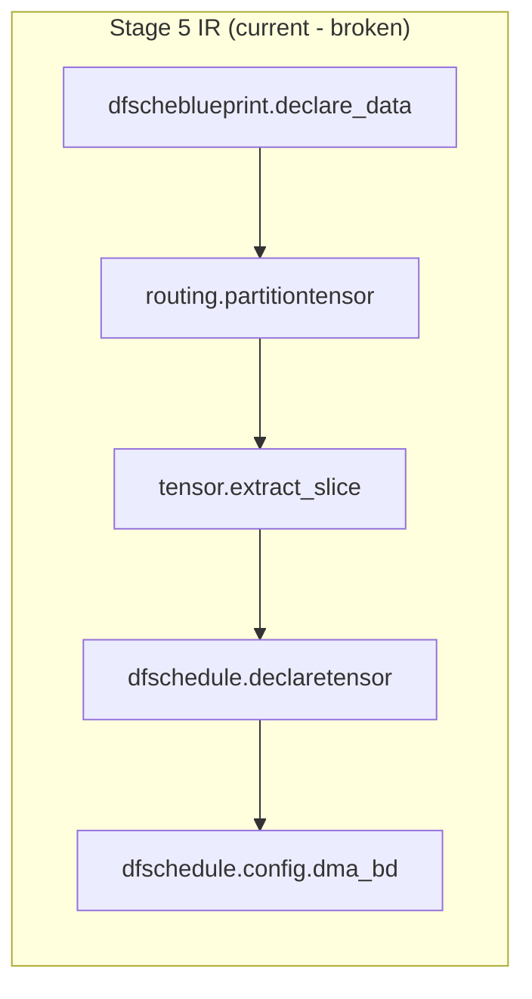
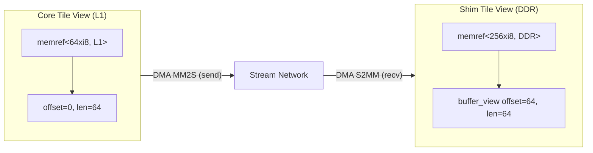
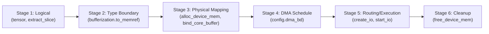
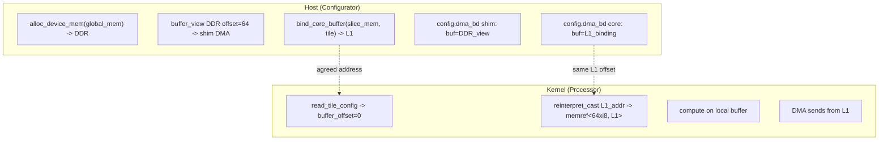

<!-- Copyright (C) 2025 Advanced Micro Devices, Inc. All Rights Reserved.
     SPDX-License-Identifier: MIT -->
---
name: Fix dfschedule tensor-memref lowering
overview: Redesign BlueprintToSchedulePass using a 6-stage progressive lowering (logical -> bufferization -> physical mapping -> DMA schedule -> routing -> cleanup) with dual-memory-space (DDR/L1) awareness, standard MLIR bufferization bridge, and proper memory lifecycle.
todos:
  - id: add-ops
    content: "Add new ops to dfschedule TableGen: buffer_view, bind_core_buffer; add StorageScope attribute (L1/L2/DDR); update alloc_device_mem signature to take memref input; regenerate .inc files"
    status: pending
  - id: blueprint-to-schedule
    content: "Rewrite BlueprintToSchedulePass with 6-stage lowering: (1) keep tensors, (2) bufferization.to_memref bridge, (3) alloc_device_mem for DDR + bind_core_buffer for L1, (4) DMA BDs, (5) IO, (6) free_device_mem"
    status: pending
  - id: canonicalize
    content: Update ScheduleCanonicalizePass to work with buffer_view and bind_core_buffer ops instead of tensor slice chains and memref::AllocOp fallback
    status: pending
  - id: to-api
    content: "Update DfscheduleToApiPass: buffer_view -> pointer arithmetic, bind_core_buffer -> L1 address, alloc_device_mem -> XAie_MemAllocate+memcpy, free_device_mem -> XAie_MemFree"
    status: pending
  - id: test
    content: Regenerate TableGen, rebuild, run unitest, verify host.cc has correct dual-memory addressing and proper DDR lifecycle
    status: pending
isProject: false
---

# Fix dfschedule Tensor/Memref Mixed-Use and Memory Lifecycle

Reference: [Host-Core Tile Cooperation Discussion](src/mlir/mlirfront/tilinglinalg/pass/unitest/ir/blueprinttodfschedule.md)

## Problem Analysis

After `BlueprintToSchedulePass` (stage 5) and even after `ScheduleCanonicalizePass` (stage 6), the dfschedule IR has four distinct problems:

### P1: Mixed Abstraction Levels

The IR simultaneously contains ops from three abstraction layers:




- `dfscheblueprint.declare_data` and `routing.partitiontensor` are **upstream dialect ops** that should have been consumed
- `tensor.extract_slice` is a **logical slicing op** with value semantics, not suitable for a schedule that describes physical buffer management
- `dfschedule.declaretensor` is a **semantic band-aid** that just says "treat this tensor as a memref" without any real allocation or buffer management

### P2: No Memory Lifecycle

- `XAie_MemAllocate` in host.cc is never freed (`XAie_MemFree` / `__Runtime_track_alloc` not emitted)
- No `memref.dealloc` anywhere in the pipeline
- Fallback `memref.alloc` in `ScheduleCanonicalizePass` has no matching dealloc
- The pipeline silently relies on `__Runtime_auto_teardown()`, which only frees tracked allocations -- and the main allocation is never tracked

### P3: Inconsistent Shape Representation

- `BlueprintToSchedulePass` flattens tensors to 1D memrefs: `memref<128xi8>`
- `ScheduleCanonicalizePass` recreates them as shaped memrefs: `memref<8x16xi8>`
- `DfscheduleToApiPass` ignores shapes entirely and extracts `void`* via `__runtime_buffer_arg`

### P4: No Distinction Between DDR and L1 Memory Spaces (Host-Core Cooperation)

This is the most architecturally significant problem, identified in the [host-core cooperation discussion](src/mlir/mlirfront/tilinglinalg/pass/unitest/ir/blueprinttodfschedule.md).

**The fundamental issue**: Shim tiles and Core tiles operate on completely different memory spaces, but the current IR treats them identically using the same `declaretensor` + `PartitionTensor` abstraction.

- **Shim tile (DDR)**: Connects to external DDR via NoC. Its DMA BD buffer address is a **global DDR offset** computed from `extract_slice` indices. Memory is dynamically allocated (`XAie_MemAllocate`) and must be freed.
- **Core tile (L1)**: Has private SRAM. Its DMA BD buffer address is a **fixed local L1 offset** (like CMA-reserved memory). No alloc/free -- the address is pre-known and agreed upon between host and kernel.

**Current broken behavior**: The host.cc passes DDR-derived `PartitionTensor` views as the buffer for core tile DMA BDs, but a core tile's DMA can only access its own L1 memory. The runtime (`__Runtime_dma_bd_config`) likely handles the translation silently, but the IR does not model reality.

**The "puzzle" cooperation model** (from the discussion):

- Core tiles are **senders** (MM2S): "I am this puzzle piece" -- they send computed results from L1
- Shim tile is the **receiver** (S2MM): "I place the puzzle piece at position (4,0) on the table" -- it writes to DDR at the correct global offset
- The `flow_transfer` SSA link is the "god's-eye view" that connects both sides




## Correct Approach: 6-Stage Progressive Lowering

Reference: [Tensor-Bufferize-Memref Merge Design](src/mlir/mlirfront/tilinglinalg/pass/unitest/ir/tensorbufferizememrefmerge.md)

The core insight is that the lowering should be decomposed into **six explicit stages**, each with a clear responsibility. This avoids the current "everything at once" approach that mixes abstraction levels.




### Stage 1: Logical Layer (unchanged from blueprint)

Pure math, no side effects, no physical addresses. Keep tensor ops as-is:

- `arith.constant dense<...> : tensor<16x16xi8>` -- logical data
- `tensor.extract_slice` -- logical partitioning into slices

These ops carry the **shape and data provenance** information. They are NOT eliminated -- they become inputs to Stage 2.

### Stage 2: Type Boundary (`bufferization.to_memref`)

The standard MLIR bridge from tensor to memref. **No allocation, no side effects** -- purely a type conversion that produces shaped memrefs:

```mlir
%global_mem = bufferization.to_memref %global_tensor : memref<16x16xi8>
%slice_0_mem = bufferization.to_memref %slice_0 : memref<8x16xi8>
%slice_1_mem = bufferization.to_memref %slice_1 : memref<8x16xi8>
```

This replaces the broken `dfschedule.declaretensor` with MLIR's standard infrastructure. The shaped memrefs serve as inputs to Stage 3, preserving the SSA chain from logical data.

### Stage 3: Physical Mapping (dual-path)

This is where memory becomes physical. Two distinct paths based on memory space:

**DDR path (Host/Shim):**

```mlir
%ddr_buf = dfschedule.alloc_device_mem(%global_mem)
    : (memref<16x16xi8>) -> memref<256xi8, #aie.storage_scope<DDR>>
%shim_view = dfschedule.buffer_view %ddr_buf {offset = 0, len = 128}
    : memref<256xi8, #aie.storage_scope<DDR>> -> memref<128xi8, #aie.storage_scope<DDR>>
```

- `alloc_device_mem` takes the bufferized memref as input -> allocates DDR + copies data. One op does alloc+init.
- `buffer_view` creates offset subviews into the DDR allocation.

**L1 path (Core tiles):**

```mlir
%ping_buf = dfschedule.bind_core_buffer(%slice_0_mem, %core0) {offset = 0}
    : (memref<8x16xi8>, !dfschedule.tile) -> memref<128xi8, #aie.storage_scope<L1>>
%pong_buf = dfschedule.bind_core_buffer(%slice_1_mem, %core0) {offset = 128}
    : (memref<8x16xi8>, !dfschedule.tile) -> memref<128xi8, #aie.storage_scope<L1>>
```

- `bind_core_buffer` takes a bufferized memref + tile -> anchors it at a known L1 offset. **No allocation** -- it's a bind/anchor operation on pre-reserved hardware memory.
- The memref input preserves SSA provenance (we can trace back to which logical tensor slice this L1 region holds).
- The `offset` attribute is the L1 byte address within the tile's data memory.

### Stage 4: DMA Schedule

Pure physical addressing -- DMA BD configs reference the Stage 3 outputs:

- Shim DMA BDs use `buffer_view` results (DDR addresses)
- Core DMA BDs use `bind_core_buffer` results (L1 addresses)
- Locks, packet IDs, ping-pong chaining are configured here

### Stage 5: Routing and Execution

`create_io`, `start_io`, `launch_kernel_group`, `schedule.wait` -- unchanged from current design.

### Stage 6: Cleanup

`dfschedule.free_device_mem` for DDR allocations. L1 has no lifecycle.

### Design Principles

**1. Memory Space attribute is MANDATORY** (per [Gemini feedback](src/mlir/mlirfront/tilinglinalg/pass/unitest/ir/memspac.md))

MLIR's built-in passes inspect the memref type, not the producing op. Without `#aie.storage_scope<L1>` on the type, Vectorization and alias analysis may apply incorrect DDR-specific optimizations.

- `bind_core_buffer` result: `memref<Nxi8, #aie.storage_scope<L1>>`
- `alloc_device_mem` result: `memref<Nxi8, #aie.storage_scope<DDR>>`
- `buffer_view` result: inherits memory space from input

**2. `bind_core_buffer` takes memref input (not just tile)**

This is the key difference from the previous `core_buffer` design. By taking the bufferized memref as input, the SSA chain is preserved:

```
tensor -> bufferization.to_memref -> memref -> bind_core_buffer -> L1 memref
```

This enables traceability: from any L1 buffer, you can walk the def-use chain backward to find which logical tensor slice it represents. This is critical for verifying data correctness.

**3. `alloc_device_mem` takes memref input (replaces alloc + copy_h2d)**

One op handles both allocation and initialization. No separate `copy_h2d` needed. At the API level, this maps to `XAie_MemAllocate` + `XAie_MemGetVAddr` + `memcpy`.

**4. Flat 1D memref for physical layer**

Stage 3+ uses `memref<Nxi8>` (byte-addressed). DMA operates on byte offsets/lengths. Shape information lives in Stage 1-2 only.

## Example: Correct dfschedule IR (6-Stage)

Given the same input blueprint from stage 4, the correct lowered IR should look like:

```mlir
module attributes {codegen.headers = ["stdint.h", "stdio.h", "custom_lib.h"]} {
  func.func @main() {
    // ============================================================
    // Stage 1: Logical Layer
    // Pure math -- tensor ops define data shape and partitioning
    // ============================================================
    %global_tensor = arith.constant dense<"0x01020304..."> : tensor<16x16xi8>
    %slice_0 = tensor.extract_slice %global_tensor[0, 0] [8, 16] [1, 1]
        : tensor<16x16xi8> to tensor<8x16xi8>
    %slice_1 = tensor.extract_slice %global_tensor[8, 0] [8, 16] [1, 1]
        : tensor<16x16xi8> to tensor<8x16xi8>
    %tile_slice_0_0 = tensor.extract_slice %slice_0[0, 0] [4, 16] [1, 1]
        : tensor<8x16xi8> to tensor<4x16xi8>
    %tile_slice_0_1 = tensor.extract_slice %slice_0[4, 0] [4, 16] [1, 1]
        : tensor<8x16xi8> to tensor<4x16xi8>
    %tile_slice_1_0 = tensor.extract_slice %slice_1[0, 0] [4, 16] [1, 1]
        : tensor<8x16xi8> to tensor<4x16xi8>
    %tile_slice_1_1 = tensor.extract_slice %slice_1[4, 0] [4, 16] [1, 1]
        : tensor<8x16xi8> to tensor<4x16xi8>

    // ============================================================
    // Stage 2: Type Boundary (bufferization.to_memref)
    // Standard MLIR bridge: tensor -> memref. No allocation!
    // Shaped memrefs preserve dimensional info from tensors.
    // ============================================================
    %global_mem = bufferization.to_memref %global_tensor : memref<16x16xi8>
    %slice_0_mem = bufferization.to_memref %slice_0 : memref<8x16xi8>
    %slice_1_mem = bufferization.to_memref %slice_1 : memref<8x16xi8>
    %tile_0_0_mem = bufferization.to_memref %tile_slice_0_0 : memref<4x16xi8>
    %tile_0_1_mem = bufferization.to_memref %tile_slice_0_1 : memref<4x16xi8>
    %tile_1_0_mem = bufferization.to_memref %tile_slice_1_0 : memref<4x16xi8>
    %tile_1_1_mem = bufferization.to_memref %tile_slice_1_1 : memref<4x16xi8>

    // ============================================================
    // Stage 3: Physical Mapping
    // DDR: alloc + buffer_view (dynamic, must be freed)
    // L1:  bind_core_buffer (static, pre-reserved, no lifecycle)
    // ============================================================
    %shim = dfschedule.declaretile {col = 2, row = 0} : !dfschedule.tile
    %core0 = dfschedule.declaretile {col = 0, row = 3} : !dfschedule.tile
    %core1 = dfschedule.declaretile {col = 1, row = 3} : !dfschedule.tile
    %core2 = dfschedule.declaretile {col = 0, row = 4} : !dfschedule.tile
    %core3 = dfschedule.declaretile {col = 1, row = 4} : !dfschedule.tile

    // --- DDR: allocate + init from bufferized root memref ---
    %ddr_buf = dfschedule.alloc_device_mem(%global_mem)
        : (memref<16x16xi8>) -> memref<256xi8, #aie.storage_scope<DDR>>

    // --- DDR: subviews for shim DMA (global offsets) ---
    %shim_view_0 = dfschedule.buffer_view %ddr_buf {offset = 0, len = 128}
        : memref<256xi8, #aie.storage_scope<DDR>> -> memref<128xi8, #aie.storage_scope<DDR>>
    %shim_view_1 = dfschedule.buffer_view %ddr_buf {offset = 128, len = 128}
        : memref<256xi8, #aie.storage_scope<DDR>> -> memref<128xi8, #aie.storage_scope<DDR>>

    // --- L1: bind per-tile buffers (pre-reserved local memory) ---
    // Ping buffer at L1 offset 0, pong at offset 64 (per tile)
    %core0_ping = dfschedule.bind_core_buffer(%tile_0_0_mem, %core0) {offset = 0}
        : (memref<4x16xi8>, !dfschedule.tile) -> memref<64xi8, #aie.storage_scope<L1>>
    %core0_pong = dfschedule.bind_core_buffer(%tile_0_1_mem, %core0) {offset = 64}
        : (memref<4x16xi8>, !dfschedule.tile) -> memref<64xi8, #aie.storage_scope<L1>>
    %core1_ping = dfschedule.bind_core_buffer(%tile_0_1_mem, %core1) {offset = 0}
        : (memref<4x16xi8>, !dfschedule.tile) -> memref<64xi8, #aie.storage_scope<L1>>
    %core1_pong = dfschedule.bind_core_buffer(%tile_0_0_mem, %core1) {offset = 64}
        : (memref<4x16xi8>, !dfschedule.tile) -> memref<64xi8, #aie.storage_scope<L1>>
    %core2_ping = dfschedule.bind_core_buffer(%tile_1_0_mem, %core2) {offset = 0}
        : (memref<4x16xi8>, !dfschedule.tile) -> memref<64xi8, #aie.storage_scope<L1>>
    %core2_pong = dfschedule.bind_core_buffer(%tile_1_1_mem, %core2) {offset = 64}
        : (memref<4x16xi8>, !dfschedule.tile) -> memref<64xi8, #aie.storage_scope<L1>>
    %core3_ping = dfschedule.bind_core_buffer(%tile_1_1_mem, %core3) {offset = 0}
        : (memref<4x16xi8>, !dfschedule.tile) -> memref<64xi8, #aie.storage_scope<L1>>
    %core3_pong = dfschedule.bind_core_buffer(%tile_1_0_mem, %core3) {offset = 64}
        : (memref<4x16xi8>, !dfschedule.tile) -> memref<64xi8, #aie.storage_scope<L1>>

    // ============================================================
    // Stage 4: DMA Schedule
    // Shim BDs reference DDR views, Core BDs reference L1 bindings
    // ============================================================
    %c0 = arith.constant 0 : i32
    %c1 = arith.constant 1 : i32

    // --- Shim S2MM: linear chain (receive partition 0, then partition 1) ---
    %shim_bd0 = dfschedule.config.dma_bd(%shim_view_0, %shim, %c0) {
      offset = 0, len = 128, next_bd = 1, enable_packet = true, packet_id = 0,
      acquire_lock_id = 0, acquire_lock_val = 0,
      release_lock_id = 0, release_lock_val = 0, data_id = 0
    } : (memref<128xi8, #aie.storage_scope<DDR>>, !dfschedule.tile, i32)
        -> !dfschedule.bd_handle
    %shim_bd1 = dfschedule.config.dma_bd(%shim_view_1, %shim, %c1) {
      offset = 0, len = 128, next_bd = 4294967295, enable_packet = true, packet_id = 0,
      acquire_lock_id = 0, acquire_lock_val = 0,
      release_lock_id = 0, release_lock_val = 0, data_id = 0
    } : (memref<128xi8, #aie.storage_scope<DDR>>, !dfschedule.tile, i32)
        -> !dfschedule.bd_handle

    // --- Core0 MM2S: ping-pong ring (offset=0 in L1, lock-synchronized) ---
    %core0_bd_ping = dfschedule.config.dma_bd(%core0_ping, %core0, %c0) {
      offset = 0, len = 64, next_bd = 1, enable_packet = true, packet_id = 0,
      acquire_lock_id = 0, acquire_lock_val = -1,
      release_lock_id = 1, release_lock_val = 1, data_id = -1
    } : (memref<64xi8, #aie.storage_scope<L1>>, !dfschedule.tile, i32)
        -> !dfschedule.bd_handle
    %core0_bd_pong = dfschedule.config.dma_bd(%core0_pong, %core0, %c1) {
      offset = 0, len = 64, next_bd = 0, enable_packet = true, packet_id = 0,
      acquire_lock_id = 2, acquire_lock_val = -1,
      release_lock_id = 3, release_lock_val = 1, data_id = -1
    } : (memref<64xi8, #aie.storage_scope<L1>>, !dfschedule.tile, i32)
        -> !dfschedule.bd_handle

    // ... (repeat for core1, core2, core3 with appropriate ping/pong bindings)

    // ============================================================
    // Stage 5: Routing and Execution
    // ============================================================
    %shim_io = dfschedule.config.create_io(%shim_bd0, %shim) {
      channel = 0, direction = "S2MM", io_operation = "RECV"
    } : (!dfschedule.bd_handle, !dfschedule.tile) -> !dfschedule.io_handle
    %core0_io = dfschedule.config.create_io(%core0_bd_ping, %core0) {
      channel = 0, direction = "MM2S", io_operation = "SEND"
    } : (!dfschedule.bd_handle, !dfschedule.tile) -> !dfschedule.io_handle

    // ... (create_io for core1, core2, core3)

    %kc0 = dfschedule.declare_kernel_config @kernelconfig0 {
      tile_configs = [{
        buffer_offset = 0 : i32, buffer_size = 64 : i32,
        buffer_mode = 1 : i32, num_buffers = 2 : i32,
        dma_channel = 0 : i32, packet_id = 0 : i32,
        acquire_lock_id = 0 : i32, release_lock_id = 1 : i32,
        tile_index = 0 : i32
      }]
    }
    // ... (kc1, kc2, kc3)
    %kg = dfschedule.config.load_kernel_group(%core0, %core1, %core2, %core3) {
      callee = [@dskernel_receiver],
      distributed_compute_kernel_args = [@compute0, @compute0, @compute0, @compute0],
      distributed_args = [@kernelconfig0, @kernelconfig1, @kernelconfig2, @kernelconfig3]
    } : (!dfschedule.tile, !dfschedule.tile, !dfschedule.tile, !dfschedule.tile)
        -> !dfschedule.kernelgroup
    %kernel_evt = dfschedule.schedule.launch_kernel_group(%kg)
        : (!dfschedule.kernelgroup) -> !dfschedule.event

    %shim_bdid = dfschedule.schedule.getbdid(%shim) : (!dfschedule.tile) -> i32
    %shim_evt = dfschedule.schedule.start_io(%shim_io, %shim_bdid) {flow_index = 0}
        : (!dfschedule.io_handle, i32) -> !dfschedule.event
    %core0_bdid = dfschedule.schedule.getbdid(%core0) : (!dfschedule.tile) -> i32
    %core0_evt = dfschedule.schedule.start_io(%core0_io, %core0_bdid) {flow_index = 0}
        : (!dfschedule.io_handle, i32) -> !dfschedule.event

    // ... (start_io for core1, core2, core3)

    dfschedule.schedule.wait(%kernel_evt, %shim_evt, %core0_evt)
        : (!dfschedule.event, !dfschedule.event, !dfschedule.event)

    // ============================================================
    // Stage 6: Cleanup (DDR only -- L1 has no lifecycle)
    // ============================================================
    dfschedule.free_device_mem %ddr_buf : memref<256xi8, #aie.storage_scope<DDR>>

    return
  }
  dfschedule.dskernel_receiver @dskernel_receiver {}
}
```

### Bidirectional Flow Support

The example above shows Core (MM2S sender) -> Shim (S2MM receiver). The reverse direction (Shim sends input data to Core) also works symmetrically, as noted in [memspac.md](src/mlir/mlirfront/tilinglinalg/pass/unitest/ir/memspac.md):

- **Shim as sender (MM2S)**: `buffer_view` into DDR with `offset = tensor_slice_offset` (the "big reservoir" position)
- **Core as receiver (S2MM)**: `bind_core_buffer` with `offset = 0` (data lands at local L1 base)

The lowering pass must check `flowconfig.direction` and `flowconfig.type` to determine which path to take:

- `type="shim"` -> DDR path: compute global offset from `extract_slice`, use `buffer_view`
- `type="core"` -> L1 path: use `bind_core_buffer` with local offset (typically 0), ignore `extract_slice` global offset

### What Changed vs. Current IR

- **Type boundary**: Missing -> `bufferization.to_memref` (standard MLIR bridge, no allocation)
- **Root data**: `dfscheblueprint.declare_data` (upstream dialect leaked) -> `alloc_device_mem(bufferized_memref)` (one op: alloc+init)
- **Partitioning**: `routing.partitiontensor` (upstream dialect leaked) -> dissolved into Stage 1 `tensor.extract_slice`
- **Shim buffers**: `declaretensor` (semantic band-aid) -> `buffer_view` into DDR allocation (physical offset view)
- **Core buffers**: `declaretensor` (same as shim, wrong!) -> `bind_core_buffer(bufferized_memref, tile)` (pre-reserved L1)
- **SSA provenance**: Lost at `declaretensor` -> Preserved: `tensor -> to_memref -> bind_core_buffer -> L1 memref`
- **Memory space**: Implicit (same PartitionTensor) -> Explicit `#aie.storage_scope<DDR/L1>` on memref type
- **Deallocation**: None -> `free_device_mem` for DDR; L1 has no lifecycle
- **Separate copy_h2d**: Not needed -> `alloc_device_mem` takes memref input, implicitly handles data init

### Host-Core Cooperation Model

The key architectural insight from the [discussion](src/mlir/mlirfront/tilinglinalg/pass/unitest/ir/blueprinttodfschedule.md):




- **Host sets up DMA BD** for core tile with L1 buffer address (from `bind_core_buffer`)
- **Kernel reads tile_config** and uses the same `buffer_offset` to access its local L1
- **SSA traceability**: from `bind_core_buffer` you can walk backward through `bufferization.to_memref` to the original `tensor.extract_slice` to verify which logical data partition this L1 binding represents

## Executable Task Checklist

---

### Phase 1: TableGen -- Add New Ops and Attributes

- **1.1** File: `src/mlir/mlirfront/tilinglinalg/dataflowmap/dfschedule/td/dfscheduleattr.td`
  - Function: (top-level, after line 50 `dsdirectionAttr`)
  - Action: Add `StorageScope` enum attribute definition
  - Code to add:

```tablegen
    def AIE_L1  : I32EnumAttrCase<"L1",  0, "L1">;
    def AIE_L2  : I32EnumAttrCase<"L2",  1, "L2">;
    def AIE_DDR : I32EnumAttrCase<"DDR", 2, "DDR">;
    def AIE_StorageScopeEnum : I32EnumAttr<"StorageScopeEnum",
        "AIE storage scope", [AIE_L1, AIE_L2, AIE_DDR]> {
      let genSpecializedAttr = 0;
      let cppNamespace = "dfschedule";
    }
    def AIE_StorageScopeAttr : EnumAttr<dfscheduledialect,
        AIE_StorageScopeEnum, "storage_scope"> {
      let assemblyFormat = "`<` $value `>`";
    }
    

```

- Expected: `gen.sh` generates `dfscheduleenums.h.inc` / `dfscheduleenums.cc.inc` with `StorageScopeEnum` and `StorageScopeEnumAttr`
- **1.2** File: `src/mlir/mlirfront/tilinglinalg/dataflowmap/dfschedule/td/dfscheduleop.td`
  - Function: (top-level, after `dfschedule_AllocDeviceMemOp` at line 553)
  - Action: Add `dfschedule_BufferViewOp` definition
  - Code to add:

```tablegen
    def dfschedule_BufferViewOp : dfscheduleop<"buffer_view"> {
      let summary = "Create a byte-offset view into a DDR buffer";
      let arguments = (ins AnyMemRef:$base, I64Attr:$offset, I64Attr:$len);
      let results = (outs AnyMemRef:$view);
      let assemblyFormat = "$base attr-dict `:` type($base) `->` type($view)";
    }
    

```

- Expected: Generates `BufferViewOp` class with `getBase()`, `getOffset()`, `getLen()`, `getView()` accessors
- **1.3** File: `src/mlir/mlirfront/tilinglinalg/dataflowmap/dfschedule/td/dfscheduleop.td`
  - Function: (top-level, after `dfschedule_BufferViewOp`)
  - Action: Add `dfschedule_BindCoreBufferOp` definition
  - Code to add:

```tablegen
    def dfschedule_BindCoreBufferOp : dfscheduleop<"bind_core_buffer"> {
      let summary = "Bind a logical memref to pre-reserved L1 memory on a core tile";
      let arguments = (ins AnyMemRef:$source, dfschedule_TileHandleType:$tile, I64Attr:$offset);
      let results = (outs AnyMemRef:$buffer);
      let assemblyFormat = "`(` $source `,` $tile `)` attr-dict `:` `(` type($source) `,` type($tile) `)` `->` type($buffer)";
    }
    

```

- Expected: Generates `BindCoreBufferOp` class with `getSource()`, `getTile()`, `getOffset()`, `getBuffer()` accessors
- **1.4** File: `src/mlir/mlirfront/tilinglinalg/dataflowmap/dfschedule/td/dfscheduleop.td`
  - Function: `dfschedule_AllocDeviceMemOp` (line 548-553)
  - Action: Change from no-argument to taking a memref input
  - Before:

```tablegen
    let arguments = (ins);
    let results   = (outs AnyMemRef:$memref);
    let assemblyFormat = "attr-dict `:` type($memref)";
    

```

- After:

```tablegen
    let arguments = (ins AnyMemRef:$source);
    let results   = (outs AnyMemRef:$memref);
    let assemblyFormat = "`(` $source `)` attr-dict `:` `(` type($source) `)` `->` type($memref)";
    

```

- Expected: `AllocDeviceMemOp` now has `getSource()` accessor returning the input memref
- **1.5** File: `src/mlir/mlirfront/tilinglinalg/dataflowmap/dfschedule/gen.sh`
  - Function: N/A (shell script)
  - Action: Run to regenerate all `.inc` files
  - Command: `cd src/mlir/mlirfront/tilinglinalg/dataflowmap/dfschedule && bash gen.sh --llvm-bin $LLVM_INSTALL_DIR/bin --mlir-include $LLVM_INSTALL_DIR/include`
  - Expected: 10 `.inc` files regenerated under `inc/` directory. No `mlir-tblgen` errors.
- **1.6** File: `src/mlir/mlirfront/tilinglinalg/dataflowmap/dfschedule/inc/*.inc`
  - Action: Verify the regenerated files compile
  - Expected: `BufferViewOp`, `BindCoreBufferOp`, `StorageScopeEnum`, `StorageScopeEnumAttr` are present in `.h.inc` files

---

### Phase 2: BlueprintToSchedulePass -- Rewrite FlowTransferConversion

- **2.1** File: `src/mlir/mlirfront/tilinglinalg/pass/passblueprinttoschedule/passblueprinttoschedule.cpp`
  - Function: (top-level, before `FlowTransferConversion` struct at line 192)
  - Action: Add helper function `computeByteOffset`
  - Code signature:

```cpp
    static int64_t computeByteOffset(Value tensorVal, Type elemType) {
        // Walk backward through tensor.extract_slice chain, accumulate byte offsets
        // offset_bytes = sum( offset[dim] * stride_in_elements * elemSizeBytes )
        // For row-major 2D: offset_bytes = offset[0] * shape[1] * elemSize + offset[1] * elemSize
    }
    

```

- Expected: Given a `tensor.extract_slice` result value, returns the cumulative byte offset from the root tensor
- **2.2** File: `src/mlir/mlirfront/tilinglinalg/pass/passblueprinttoschedule/passblueprinttoschedule.cpp`
  - Function: `FlowTransferConversion::matchAndRewrite` (lines 260-280)
  - Action: Replace the shim-side `DeclareTensorOp` creation with 3-stage buffer setup
  - Before (lines 260-273):

```cpp
    if (auto tensorType = dyn_cast<RankedTensorType>(viewType)) {
        int64_t totalSize = 1;
        for (int64_t dim : tensorType.getShape()) totalSize *= dim;
        memrefType = MemRefType::get({totalSize}, tensorType.getElementType());
        memrefValue = rewriter.create<dfschedule::DeclareTensorOp>(loc, memrefType, viewValue);
    }
    

```

- After:

```cpp
    if (auto tensorType = dyn_cast<RankedTensorType>(viewType)) {
        // Stage 2: bufferization bridge
        auto shapedMemrefType = MemRefType::get(tensorType.getShape(), tensorType.getElementType());
        auto toMemref = rewriter.create<bufferization::ToMemrefOp>(loc, shapedMemrefType, viewValue);
        // Stage 3: DDR allocation
        int64_t totalSize = 1;
        for (int64_t dim : tensorType.getShape()) totalSize *= dim;
        auto flatDDRType = MemRefType::get({totalSize}, tensorType.getElementType());
        auto allocDDR = rewriter.create<dfschedule::AllocDeviceMemOp>(loc, flatDDRType, toMemref.getResult());
        ddrBuffer = allocDDR.getMemref();  // save for free_device_mem later
        memrefType = flatDDRType;
        memrefValue = ddrBuffer;
    }
    

```

- Expected: IR emits `bufferization.to_memref` + `dfschedule.alloc_device_mem` instead of `dfschedule.declaretensor`
- **2.3** File: `src/mlir/mlirfront/tilinglinalg/pass/passblueprinttoschedule/passblueprinttoschedule.cpp`
  - Function: `FlowTransferConversion::matchAndRewrite` (lines 330-346, shim DMA BD creation)
  - Action: Add `buffer_view` between DDR alloc and shim `config.dma_bd`
  - Code: Before the `ConfigDmaBdOp` creation:

```cpp
    // Stage 3: DDR subview for shim
    int64_t shimByteOffset = computeByteOffset(shimFlowConfig.getView(), tensorType.getElementType());
    auto bufferView = rewriter.create<dfschedule::BufferViewOp>(
        loc, memrefType, ddrBuffer,
        rewriter.getI64IntegerAttr(shimByteOffset),
        rewriter.getI64IntegerAttr(bufferLen * elemSizeBytes));
    // Use bufferView.getView() as ConfigDmaBdOp buffer operand instead of memrefValue
    

```

- Expected: Shim `config.dma_bd` receives a `buffer_view` result (DDR offset view) instead of the full root tensor
- **2.4** File: `src/mlir/mlirfront/tilinglinalg/pass/passblueprinttoschedule/passblueprinttoschedule.cpp`
  - Function: `FlowTransferConversion::matchAndRewrite` (lines 448-465, per-core-tile `DeclareTensorOp` creation)
  - Action: Replace per-tile `DeclareTensorOp` with `bufferization.to_memref` + `bind_core_buffer`
  - Before (lines 464-465):

```cpp
    Value perTileMemref =
        rewriter.create<dfschedule::DeclareTensorOp>(loc, perTileMemrefType, perTileTensor);
    

```

- After:

```cpp
    // Stage 2: bufferize the per-tile tensor slice
    auto perTileShapedType = MemRefType::get(
        cast<RankedTensorType>(perTileType).getShape(),
        cast<RankedTensorType>(perTileType).getElementType());
    auto perTileToMemref = rewriter.create<bufferization::ToMemrefOp>(
        loc, perTileShapedType, perTileTensor);
    

```

- Expected: Per-tile tensor slices are first converted to memref via standard `bufferization.to_memref`
- **2.5** File: `src/mlir/mlirfront/tilinglinalg/pass/passblueprinttoschedule/passblueprinttoschedule.cpp`
  - Function: `FlowTransferConversion::matchAndRewrite` (lines 484-518, ping-pong BD creation)
  - Action: Replace both pong/ping `ConfigDmaBdOp` buffer operands with `bind_core_buffer` results
  - Before: both ping and pong BDs use `perTileMemref` (from `DeclareTensorOp`)
  - After:

```cpp
    // Stage 3: bind to L1 for ping-pong
    int64_t pingL1Offset = 0;
    int64_t pongL1Offset = perTileTotalSize * elementSizeBytes;
    auto pingL1 = rewriter.create<dfschedule::BindCoreBufferOp>(
        loc, perTileMemrefType, perTileToMemref.getResult(),
        coreTileOp.getTile(), rewriter.getI64IntegerAttr(pingL1Offset));
    auto pongL1 = rewriter.create<dfschedule::BindCoreBufferOp>(
        loc, perTileMemrefType, perTileToMemref.getResult(),
        coreTileOp.getTile(), rewriter.getI64IntegerAttr(pongL1Offset));
    // Use pingL1.getBuffer() for ping ConfigDmaBdOp, pongL1.getBuffer() for pong ConfigDmaBdOp
    

```

- Expected: Core tile ping BD uses `bind_core_buffer(offset=0)`, pong BD uses `bind_core_buffer(offset=perTileSize)`
- **2.6** File: `src/mlir/mlirfront/tilinglinalg/pass/passblueprinttoschedule/passblueprinttoschedule.cpp`
  - Function: `FlowTransferConversion::matchAndRewrite` (after line 606, after `ScheduleWaitOp`)
  - Action: Add `free_device_mem` for DDR lifecycle
  - Code: After the `ScheduleWaitOp`:

```cpp
    // Stage 6: cleanup DDR allocation
    rewriter.create<dfschedule::FreeDeviceMemOp>(loc, ddrBuffer);
    

```

- Expected: `dfschedule.free_device_mem` appears after `schedule.wait` in the output IR
- **2.7** File: `src/mlir/mlirfront/tilinglinalg/pass/passblueprinttoschedule/passblueprinttoschedule.cpp`
  - Function: `FlowTransferConversion::matchAndRewrite` (lines 439, remove debug `printf`)
  - Action: Remove all `printf("****&&&...")` debug statements (lines 439, 443, 447, 531)
  - Expected: No debug `printf` in production code
- **2.8** File: `src/mlir/mlirfront/tilinglinalg/pass/passblueprinttoschedule/passblueprinttoschedule.cpp`
  - Function: `BlueprintToSchedulePass::runOnOperation` (line 669)
  - Action: Uncomment `target.addIllegalOp<dfscheblueprint::DeclareDataOp>()` so `DeclareDataOp` is properly converted
  - Before: `//target.addIllegalOp<dfscheblueprint::DeclareDataOp>();`
  - After: `target.addIllegalOp<dfscheblueprint::DeclareDataOp>();`
  - Expected: Conversion framework now requires `DeclareDataOp` to be lowered or erased
- **2.9** File: `src/mlir/mlirfront/tilinglinalg/pass/passblueprinttoschedule/passblueprinttoschedule.cpp`
  - Function: `BlueprintToSchedulePass::runOnOperation` (line 657-664, legal dialects)
  - Action: Verify `bufferization::BufferizationDialect` is in the legal dialects list (already present at line 663)
  - Expected: `bufferization.to_memref` is legal and won't trigger errors

---

### Phase 3: ScheduleCanonicalizePass -- Simplify Buffer Management

- **3.1** File: `src/mlir/mlirfront/tilinglinalg/pass/passschedulecanonicalize/passschedulecanonicalize.cpp`
  - Function: Collection loop (lines 223-283, inside `extractSlice` branch)
  - Action: Remove the `tensor::ExtractSliceOp` collection logic (`SliceParams`, `isFromPartition`, `parentSliceIndex` walking). This entire branch can be removed because `buffer_view` / `bind_core_buffer` already carry explicit offsets.
  - Expected: `info.extractSliceOps` and `info.uniqueSliceParams` are no longer populated
- **3.2** File: `src/mlir/mlirfront/tilinglinalg/pass/passschedulecanonicalize/passschedulecanonicalize.cpp`
  - Function: Slice recreation (lines 960-1010, `sliceMap` creation)
  - Action: Remove the two-pass slice recreation logic (first pass for `isFromPartition`, second pass for nested slices). No longer needed.
  - Expected: No `tensor.extract_slice` ops are created in the canonical host block
- **3.3** File: `src/mlir/mlirfront/tilinglinalg/pass/passschedulecanonicalize/passschedulecanonicalize.cpp`
  - Function: `DeclareTensorOp` creation (lines 1032-1055)
  - Action: Remove the entire block that creates `dfschedule.declaretensor` from leaf slices and intermediate slices. Replace with: clone existing `buffer_view` / `bind_core_buffer` ops from the source IR.
  - Expected: No `declaretensor` ops in the canonicalized output. `buffer_view` and `bind_core_buffer` pass through.
- **3.4** File: `src/mlir/mlirfront/tilinglinalg/pass/passschedulecanonicalize/passschedulecanonicalize.cpp`
  - Function: Shim BD buffer resolution (lines 1116-1148)
  - Action: Replace `intermediateMemrefs` / `declaredMemrefs` / `bufferMap` lookup with: read `buffer_view` op directly from the `ConfigDmaBdOp.getBuffer()` defining op. Clone it.
  - Before: `sliceIndex -> intermediateMemrefs[idx]` or `declaredMemrefs[idx]` or `memref::AllocOp` fallback
  - After: `ConfigDmaBdOp.getBuffer().getDefiningOp<BufferViewOp>()` -> clone the `buffer_view` into the canonical block
  - Expected: No `memref::AllocOp` fallback in the output. Shim BDs directly reference `buffer_view` results.
- **3.5** File: `src/mlir/mlirfront/tilinglinalg/pass/passschedulecanonicalize/passschedulecanonicalize.cpp`
  - Function: BD deduplication (lines 700-712)
  - Action: Change merge key from `(shimKey, data_id, sliceIndex)` to `(shimKey, data_id, buffer_view_offset)` where `buffer_view_offset` is read from the `BufferViewOp.getOffset()` attribute
  - Expected: Deduplication uses static attributes instead of tracing SSA chains
- **3.6** File: `src/mlir/mlirfront/tilinglinalg/pass/passschedulecanonicalize/passschedulecanonicalize.cpp`
  - Function: `DmaBdParams` struct and `CoreDmaBdParams` struct
  - Action: Replace `int64_t sliceIndex` field with `int64_t bufferViewOffset` (for shim) or keep the `buffer` value directly (for core)
  - Expected: Clean struct definition without slice chain tracing fields

---

### Phase 4: DfscheduleToApiPass -- Add New Lowering Patterns

- **4.1** File: `src/mlir/mlirfront/tilinglinalg/pass/passdfscheduletoapi/passdfscheduletoapi.cpp`
  - Function: (new struct, after `DeclareDataInnerPattern` at line 343)
  - Action: Add `AllocDeviceMemInnerPattern` struct
  - Logic:
    1. `adaptor.getSource()` -> `void`* (type-converted from memref)
    2. Compute `byteSize` from result memref shape
    3. Emit `XAie_MemAllocate(g_DevInst, byteSize, XAIE_MEM_CACHEABLE)` -> `XAie_MemInst*`
    4. Emit `XAie_MemGetVAddr(memInst)` -> `void*`
    5. Emit `memcpy(vaddr, srcPtr, byteSize)`
    6. Emit `__Runtime_track_alloc(memInst)` (for DDR lifecycle)
    7. `rewriter.replaceOp(op, vaddr.getResult(0))`
  - Expected: `dfschedule.alloc_device_mem` lowers to `XAie_MemAllocate` + `memcpy` + `__Runtime_track_alloc`
- **4.2** File: `src/mlir/mlirfront/tilinglinalg/pass/passdfscheduletoapi/passdfscheduletoapi.cpp`
  - Function: (new struct, after `AllocDeviceMemInnerPattern`)
  - Action: Add `BufferViewInnerPattern` struct
  - Logic:
    1. `adaptor.getBase()` -> `void`* (DDR base from AllocDeviceMemOp)
    2. Read `op.getOffset()` -> int64_t byte offset
    3. Emit `emitc::ConstantOp(offset_value)` -> i64
    4. Emit `emitc::CallOpaqueOp("__runtime_buffer_offset", {base, offset_const})` -> `void*`
      (This macro expands to `(void*)((char*)base + offset)`)
    5. `rewriter.replaceOp(op, result)`
  - Expected: `dfschedule.buffer_view` lowers to pointer arithmetic `(char*)base + offset`
- **4.3** File: `src/mlir/mlirfront/tilinglinalg/pass/passdfscheduletoapi/passdfscheduletoapi.cpp`
  - Function: (new struct, after `BufferViewInnerPattern`)
  - Action: Add `BindCoreBufferInnerPattern` struct
  - Logic:
    1. `op.getOffset()` -> int64_t L1 offset (0 for ping, buffer_size for pong)
    2. Emit `emitc::ConstantOp` with the L1 offset as an integer or `void`* cast
      (Core tile DMA BD config uses tile-local addressing; offset is relative to data memory base 0x0)
    3. `rewriter.replaceOp(op, offset_const)`
  - Expected: `dfschedule.bind_core_buffer` lowers to a constant L1 address offset
- **4.4** File: `src/mlir/mlirfront/tilinglinalg/pass/passdfscheduletoapi/passdfscheduletoapi.cpp`
  - Function: (new struct, after `BindCoreBufferInnerPattern`)
  - Action: Add `FreeDeviceMemInnerPattern` struct
  - Logic:
    1. Emit `emitc::CallOpaqueOp("__Runtime_free_all_allocs", {state.devInstRef})` (if using batch free) or `XAie_MemFree(memInst)` (if tracking individual allocs)
    2. `rewriter.eraseOp(op)`
  - Expected: `dfschedule.free_device_mem` lowers to `__Runtime_free_all_allocs()` or `XAie_MemFree()`
- **4.5** File: `src/mlir/mlirfront/tilinglinalg/pass/passdfscheduletoapi/passdfscheduletoapi.cpp`
  - Function: (new struct, after `FreeDeviceMemInnerPattern`)
  - Action: Add `BufferizationToMemrefInnerPattern` struct
  - Logic:
    1. `adaptor.getOperands()[0]` -> converted input (the tensor became a pointer)
    2. `rewriter.replaceOp(op, convertedInput)` (pass-through)
  - Expected: `bufferization.to_memref` is consumed as identity at C level
- **4.6** File: `src/mlir/mlirfront/tilinglinalg/pass/passdfscheduletoapi/passdfscheduletoapi.cpp`
  - Function: `ConfigDmaBdInnerPattern::matchAndRewrite` (lines 902-906)
  - Action: Modify buffer pointer extraction to handle three buffer source types
  - Before (lines 902-906):

```cpp
    auto bufferPtr = rewriter.create<emitc::CallOpaqueOp>(
        loc, voidPtrType, "__runtime_buffer_arg", nullptr, nullptr, ValueRange{buffer});
    

```

- After:

```cpp
    Value bufferPtr;
    if (buffer.getType().isa<emitc::PointerType>()) {
        // Already void* (from buffer_view or bind_core_buffer)
        bufferPtr = buffer;
    } else if (auto opaqueType = buffer.getType().dyn_cast<emitc::OpaqueType>()) {
        if (opaqueType.getValue() == "PartitionTensor") {
            // Legacy path: PartitionTensor -> __runtime_buffer_arg
            auto bufPtrOp = rewriter.create<emitc::CallOpaqueOp>(
                loc, voidPtrType, "__runtime_buffer_arg", nullptr, nullptr, ValueRange{buffer});
            bufferPtr = bufPtrOp.getResult(0);
        } else {
            bufferPtr = buffer;
        }
    } else {
        bufferPtr = buffer;
    }
    

```

- Then update line 926: `bufferPtr.getResult(0)` -> `bufferPtr` (since it's now a `Value`, not always a call result)
- Expected: `ConfigDmaBdOp` correctly handles `void*` from `buffer_view`/`bind_core_buffer` AND legacy `PartitionTensor`
- **4.7** File: `src/mlir/mlirfront/tilinglinalg/pass/passdfscheduletoapi/passdfscheduletoapi.cpp`
  - Function: Phase 3 pattern registration (lines 2334-2380)
  - Action: Add new patterns and remove obsolete ones
  - Add (after line 2343):

```cpp
    innerPatterns.add<AllocDeviceMemInnerPattern>(typeConverter, ctx, state, /*benefit=*/100);
    innerPatterns.add<BufferViewInnerPattern>(typeConverter, ctx, state, /*benefit=*/90);
    innerPatterns.add<BindCoreBufferInnerPattern>(typeConverter, ctx, state, /*benefit=*/90);
    innerPatterns.add<FreeDeviceMemInnerPattern>(typeConverter, ctx, state, /*benefit=*/1);
    innerPatterns.add<BufferizationToMemrefInnerPattern>(typeConverter, ctx, /*benefit=*/100);
    

```

- Remove (lines 2341-2343):

```cpp
    // innerPatterns.add<DeclareDataInnerPattern>(typeConverter, ctx);          // replaced by AllocDeviceMemInnerPattern
    // innerPatterns.add<PartitionTensorInnerPattern>(typeConverter, ctx, state); // eliminated
    // innerPatterns.add<ExtractSliceInnerPattern>(typeConverter, ctx, state);    // eliminated
    

```

- Remove (lines 2346):

```cpp
    // innerPatterns.add<DeclareTensorInnerPattern>(typeConverter, ctx, state, 100); // eliminated
    

```

- Remove (lines 2378-2380):

```cpp
    // innerPatterns.add<EraseOpLowering<routing::partitiontensor>>(typeConverter, ctx); // eliminated
    

```

- Expected: New patterns registered; old ones removed. Build compiles without errors.
- **4.8** File: `src/mlir/mlirfront/tilinglinalg/pass/passdfscheduletoapi/passdfscheduletoapi.cpp`
  - Function: Phase 3 legality (after line 2388)
  - Action: Add `bufferization::BufferizationDialect` to illegal dialects (so `to_memref` must be converted)
  - Code: `innerTarget.addIllegalDialect<bufferization::BufferizationDialect>();`
  - Also add: `innerTarget.addIllegalOp<dfschedule::AllocDeviceMemOp>();`
  - Also add: `innerTarget.addIllegalOp<dfschedule::BufferViewOp>();`
  - Also add: `innerTarget.addIllegalOp<dfschedule::BindCoreBufferOp>();`
  - Also add: `innerTarget.addIllegalOp<dfschedule::FreeDeviceMemOp>();`
  - Expected: Conversion framework ensures all new ops are converted to EmitC
- **4.9** File: `src/mlir/mlirfront/tilinglinalg/pass/passdfscheduletoapi/passdfscheduletoapi.cpp`
  - Function: Includes (top of file, around line 1-30)
  - Action: Add `#include "mlir/Dialect/Bufferization/IR/Bufferization.h"` if not already present
  - Expected: `bufferization::ToMemrefOp` is available for the new pattern
- **4.10** File: `include/aie_runtime.h` (or runtime helper)
  - Function: (new macro/inline function)
  - Action: Add `__runtime_buffer_offset` macro or inline function
  - Code:

```c
    static inline void* __runtime_buffer_offset(void* base, int64_t offset) {
        return (void*)((char*)base + offset);
    }
    

```

- Expected: `buffer_view` lowering can emit a call to this function

---

### Phase 5: Build and Verify

- **5.1** Build: regenerate TableGen `.inc` files
  - Command: `cd src/mlir/mlirfront/tilinglinalg/dataflowmap/dfschedule && bash gen.sh ...`
  - Expected: All 10 `.inc` files regenerated, no errors
- **5.2** Build: compile unitest
  - Command: `cd src/mlir/mlirfront/tilinglinalg/pass/unitest/build && cmake .. && make -j4`
  - Expected: Clean compile, no undefined references to new ops
- **5.3** Run: generate dfschedule IR
  - Command: `cd src/mlir/mlirfront/tilinglinalg/pass/unitest/build && ./test dfschedule`
  - Expected: Outputs `worklocal/host.cc` and `worklocal/kernel.cc`; IR dumps to `ir/dfschedule/5_BlueprintToSchedulePass.mlir` and `ir/dfschedule/6_ScheduleCanonicalizePass.mlir`

---

### Phase 6: Verification Tests

- **6.1** Test: No legacy ops in IR (stage 5)
  - File to check: `src/mlir/mlirfront/tilinglinalg/pass/unitest/ir/dfschedule/5_BlueprintToSchedulePass.mlir`
  - Verification commands:

```bash
    grep -c "dfschedule.declaretensor" 5_BlueprintToSchedulePass.mlir    # expect: 0
    grep -c "dfscheblueprint.flow_transfer" 5_BlueprintToSchedulePass.mlir # expect: 0
    grep -c "dfscheblueprint.flowconfig" 5_BlueprintToSchedulePass.mlir    # expect: 0
    

```

- Expected: All counts are 0
- **6.2** Test: 6-stage structure present (stage 5)
  - File to check: `5_BlueprintToSchedulePass.mlir`
  - Verification:

```bash
    grep -c "bufferization.to_memref"      # expect: >= 7 (root + 6 per-tile slices)
    grep -c "dfschedule.alloc_device_mem"  # expect: 1 (single DDR alloc)
    grep -c "dfschedule.buffer_view"       # expect: >= 2 (one per partition/shim BD)
    grep -c "dfschedule.bind_core_buffer"  # expect: >= 8 (4 tiles * 2 ping/pong)
    grep -c "dfschedule.free_device_mem"   # expect: 1
    

```

- Expected: All counts match
- **6.3** Test: Memory space tags present (stage 5)
  - File to check: `5_BlueprintToSchedulePass.mlir`
  - Verification: (if StorageScope attribute is used on memref types)

```bash
    grep -c "storage_scope" 5_BlueprintToSchedulePass.mlir  # expect: > 0
    

```

- Expected: DDR buffers tagged, L1 buffers tagged
- **6.4** Test: Canonicalized IR structure (stage 6)
  - File to check: `6_ScheduleCanonicalizePass.mlir`
  - Verification:

```bash
    grep -c "memref.alloc" 6_ScheduleCanonicalizePass.mlir        # expect: 0 (no fallback allocs)
    grep -c "dfschedule.declaretensor" 6_ScheduleCanonicalizePass.mlir # expect: 0
    grep -c "dfschedule.buffer_view" 6_ScheduleCanonicalizePass.mlir    # expect: >= 1
    grep -c "dfschedule.bind_core_buffer" 6_ScheduleCanonicalizePass.mlir # expect: >= 1
    

```

- Expected: Clean canonical form with explicit buffer ops
- **6.5** Test: Generated host.cc correctness
  - File to check: `src/mlir/mlirfront/tilinglinalg/pass/unitest/worklocal/host.cc`
  - Verification:

```bash
    grep -c "XAie_MemAllocate"              host.cc  # expect: 1
    grep -c "XAie_MemGetVAddr"              host.cc  # expect: 1
    grep -c "memcpy"                        host.cc  # expect: >= 1
    grep -c "__Runtime_track_alloc"          host.cc  # expect: >= 1
    grep -c "__runtime_buffer_offset"        host.cc  # expect: >= 2 (shim BD buffer views)
    grep -c "PartitionTensor"               host.cc  # expect: 0 (eliminated!)
    grep -c "__Runtime_init_PartitionTensor" host.cc  # expect: 0
    grep -c "__Runtime_extract_slice"        host.cc  # expect: 0
    grep -c "__Runtime_free_all_allocs\|XAie_MemFree" host.cc  # expect: >= 1
    

```

- Expected: DDR alloc+copy+offset in shim path, no PartitionTensor, DDR freed
- **6.6** Test: Offset correctness for 16x16xi8 tensor (2 partitions, 4 tiles)
  - File to check: `5_BlueprintToSchedulePass.mlir`
  - Manual verification:
    - Root: 256 bytes total
    - `buffer_view` for partition 0: offset=0, len=128
    - `buffer_view` for partition 1: offset=128, len=128
    - `bind_core_buffer` tile (0,2) ping: offset=0, pong: offset=64
    - `bind_core_buffer` tile (1,2) ping: offset=0, pong: offset=64
    - `bind_core_buffer` tile (0,3) ping: offset=0, pong: offset=64
    - `bind_core_buffer` tile (1,3) ping: offset=0, pong: offset=64
  - Expected: Byte offsets match the tensor slicing geometry
- **6.7** Test: `kernel_config.buffer_offset` consistency
  - File to check: `5_BlueprintToSchedulePass.mlir` and `6_ScheduleCanonicalizePass.mlir`
  - Verification: For each `declare_kernel_config`, the `buffer_offset` dict entry must match the `bind_core_buffer.offset` for that tile
  - Expected: Perfect match between host-side L1 offset and kernel-side buffer_offset

---

### Phase 7 (Optional): HW Round-Trip Test

- **7.1** Compile kernel: `cd worklocal && source compile_kernel.sh`
  - Expected: `build/kernel` ELF produced, no xchesscc errors
- **7.2** Compile host: `cd worklocal && source hostcompile.sh`
  - Expected: `build/host` ELF produced, no linker errors for `__runtime_buffer_offset` or `__Runtime_track_alloc`
- **7.3** HW run: `python3 script/test/apppaltest.py build/host`
  - Expected: Console output shows "device_teardown done", no "AIE ERROR"
- **7.4** Data verification: Compare output data buffer against expected 16x16 tensor values
  - Expected: Correct data arrives at DDR output buffer

