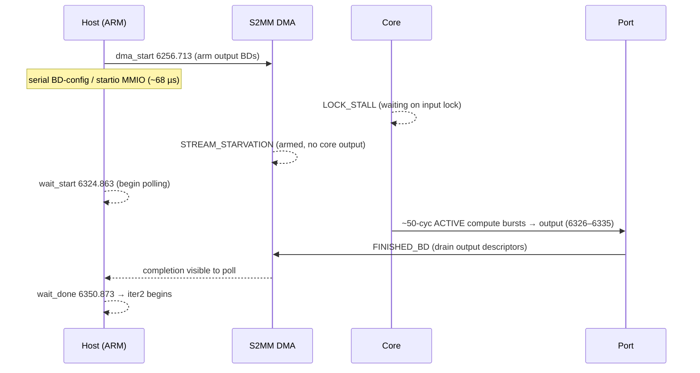
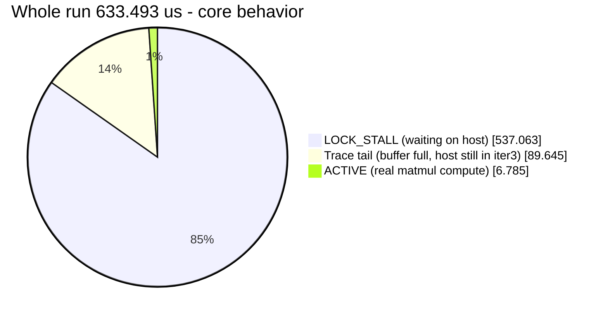
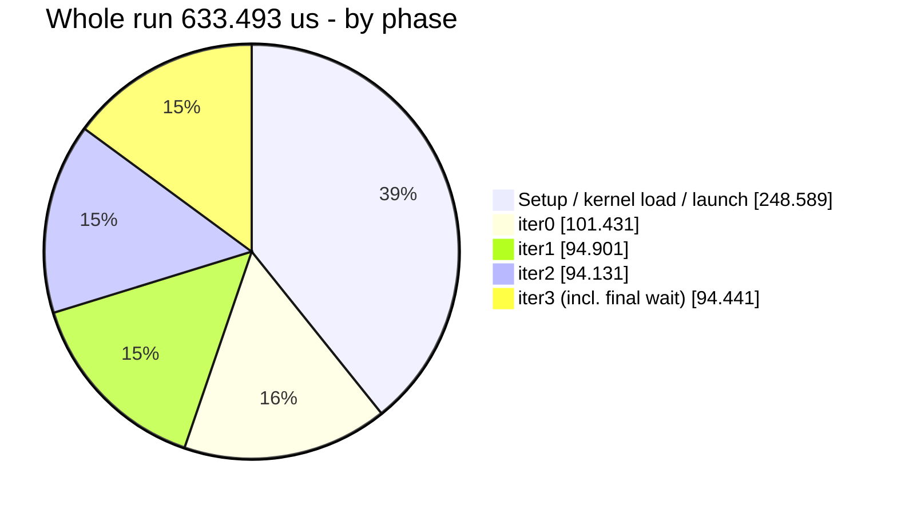
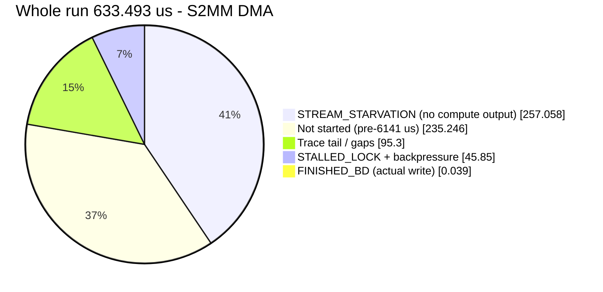
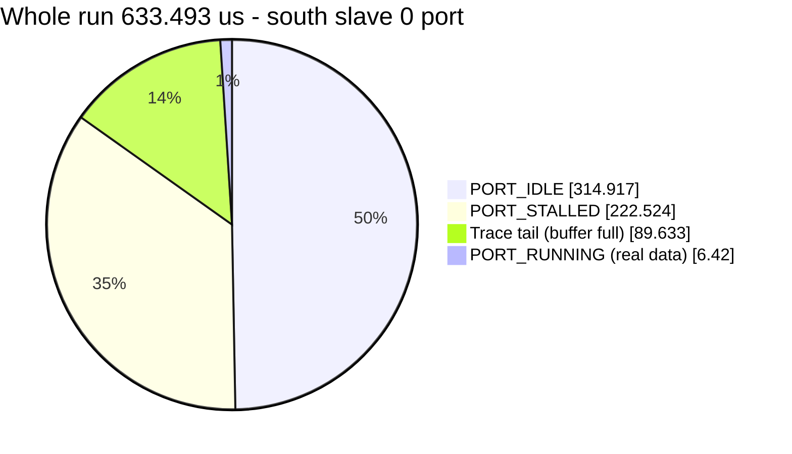

# Cross-Track Timeline Analysis — host / core / port / DMA on tile `0,3`

**Date:** 2026-08-26
**Source capture:** `timeline.csv` (repo root) — the capture behind `timeline.png` / the diagram
**Lanes:** `host`, `tile 0,3 core`, `tile 0,3 dma s2mm 1`, `tile 0,3 south slave 0`
**End-to-end window:** 5905.982 µs → **6539.475 µs** — **span 633.493 µs** (host-observed)
**Companion:** [`controlperf_analysis.md`](controlperf_analysis.md) (root-cause + host cost model)

> **Note on data source.** This document is based on the **root `timeline.csv`**, which
> includes the **host** track and the **S2MM (output) DMA**, and runs to the host's final
> `iter3.wait_done` at **6539.475 µs**. An earlier draft used
> `data/profile/matmul/mm2s0/timeline.csv`, a *separate, narrower* capture (MM2S input DMA +
> east-master port, ending 6364.758 µs); those numbers do **not** match this diagram and
> have been superseded here. Raw rows in the root CSV are duplicated ~2× and contain a few
> malformed trace labels; all figures below are computed **after de-duplicating on
> `(lane, start, end)`** and dropping malformed slivers.

This document lines up the **four tracks** for a single matmul compute tile and walks
them by iteration so it is clear *which stall on which track* waits on *which host
action*. Numbers are taken from the de-duplicated `timeline.csv` aggregate or from a
specific CSV row (timestamps quoted inline); nothing is estimated.

| Lane (CSV `lane`)         | What it measures                                             |
|---------------------------|-------------------------------------------------------------|
| `host`                    | ARM host markers: `iterN.iter_start / dma_start / wait_start / wait_done` (zero-duration points) |
| `tile 0,3 core`           | AIE core state (ACTIVE = compute, LOCK_STALL = waiting on a lock) |
| `tile 0,3 dma s2mm 1`     | S2MM (output) DMA channel state (STREAM_STARVATION, STALLED_LOCK, FINISHED_BD) |
| `tile 0,3 south slave 0`  | Stream-switch **south slave port 0** (PORT_IDLE / PORT_RUNNING / PORT_STALLED) |

---

## 1. Aggregate per-track totals

The **end-to-end window is 633.493 µs** (first tile trace 5905.982 → host `iter3.wait_done`
6539.475). Two of the tracks stop emitting HW trace at **6448.716 µs** (trace buffer full —
see §5), while the host lane continues to 6539.475; that ~90.8 µs difference is the
"trace-truncated tail" below.

### Core (`tile 0,3 core`) — span 5905.982 → 6448.716

| State                     | Time (µs)   | % of 633.493 |
|---------------------------|-------------|--------------|
| `ACTIVE\|LOCK_STALL`      | 537.063     | **84.8%**    |
| `ACTIVE` (real compute)   | 6.785       | **1.07%**    |

### Stream-switch port (`tile 0,3 south slave 0`) — span 5905.982 → 6448.716

| State              | Time (µs)   | % of 633.493 |
|--------------------|-------------|--------------|
| `PORT_IDLE_0`      | 314.917     | 49.7%        |
| `PORT_STALLED_0`   | 222.524     | 35.1%        |
| `PORT_RUNNING_0`   | 6.420       | **1.01%**    |

### S2MM DMA channel (`tile 0,3 dma s2mm 1`) — span 6141.228 → 6451.675

| State                                             | Time (µs) | % of 633.493 |
|---------------------------------------------------|-----------|--------------|
| `DMA_S2MM_1_STREAM_STARVATION_MEM` (no input data)| 257.058   | 40.6%        |
| `STALLED_LOCK` + `MEMORY_BACKPRESSURE`            | 45.85     | 7.2%         |
| `DMA_S2MM_1_FINISHED_BD_MEM` (actual write)       | 0.039     | 0.006%       |

**Reading this:** the core computes ~1% of the whole run and is lock-stalled ~85%. The
output port only *runs* 6.420 µs (1%) and is otherwise idle/stalled. The S2MM DMA spends
most of its life **stream-starved** (waiting for the compute output that never comes,
because the core is lock-stalled) and does only **0.039 µs** of real "finished BD" writes.
All four tracks agree: **the tile is starved by the host control plane, not busy.**

---

## 2. Iteration walkthrough — one beginning-to-end cross-track flow

Instead of reading each lane on its own, follow the **whole run as one story** and watch how
the four tracks (host / core / DMA / port) line up in real time. The short version:

> kernel loads → core boots and immediately face-plants into a 258 µs cold lock-stall →
> host finishes setup and arms the output DMA (`START_TASK` 6141.228, but it *starves* — no
> core output yet) → **all three HW tracks wake together at ~6164** (DMA `FINISHED_BD`
> 6163.843, port `PORT_RUNNING` 6163.994, core exits the cold stall 6163.995) → a short
> compute blip, another ~17 µs lock-stall, then the **real compute+drain burst clusters
> around `wait_start` (6230–6240)** → `iter0.wait_done` 6255.972 → the next iteration
> repeats the same shape.

### (a) Unified beginning-to-end timeline — core boot → end of iter0

One consistent, contiguous timeline. Each row is a **time window** (`from → to`), how long
it **lasts**, what each track is doing, and — most importantly — **what on one track causes
what on the others** at that time-point group. Windows run back-to-back and sum to the whole
core-boot → `iter0.wait_done` span (5905.982 → 6255.972 = **349.990 µs**).

| Window (µs) | Lasts | What each track does in this window | Cross-track cause → effect |
|-------------|-------|-------------------------------------|----------------------------|
| **5905.982 → 5906.107** | **0.125 µs** | **core** `ACTIVE` prologue (125 cyc), then requests the input lock | Core boots and asks for the lock the **host** has not released → this *arms* the stall that follows |
| **5906.107 → 6163.843** | **257.7 µs** (cold stall) | **core** in one cold `LOCK_STALL`; **host** does `iter-1.launch` 5918.409, `iter0.iter_start` 6154.571, `iter0.dma_start` 6160.972; **DMA** `START_TASK` 6141.228 → `STREAM_STARVATION`; **port** idle | **HOST** is busy streaming the kernel group + arming BDs word-by-word over serial MMIO → it **never releases the core's input lock** → **CORE** lock-stalls the entire setup → the **DMA** it armed at 6141.228 has no core output to drain, so it **STARVES** → **PORT** stays idle. One host cause, three stalled tracks. |
| **6163.843 → 6164.003** | **~0.16 µs** (the synchronized wake) | **DMA** first `FINISHED_BD` 6163.843; **port** first `PORT_RUNNING` 6163.994; **core** exits cold stall → `ACTIVE` 6163.995 | **HOST** finally releases the lock (its `dma_start` MMIO landed) → **CORE** grabs it and produces its first output → **PORT** carries that output → **DMA** drains the first BD. All three HW tracks wake **within ~0.16 µs of each other**, cascaded off the single host lock-release. |
| **6164.003 → 6178.624** | **14.6 µs** | **core** back in `LOCK_STALL` (6164.524→6178.625); **host** still issuing MMIO; **DMA**/**port** idle/starved | After the first grab the **HOST** is still serially arming the next BDs → **CORE** re-stalls waiting on the next lock → DMA/port go quiet again |
| **6178.624 → 6178.7** | **~0.08 µs** | **core** brief first compute blip (~50-cyc `ACTIVE` bursts) | A momentary lock-release lets the **CORE** compute a handful of cycles, then it re-stalls immediately |
| **6178.7 → 6229.732** | **~51.0 µs** | **core** two long `LOCK_STALL`s (6195.984→6213.211 ≈17.2 µs, 6213.217→6230.551 ≈17.3 µs); **host** issuing BD/startio MMIO up to `wait_start` 6229.732 | This is the bulk of the ~68 µs **HOST issue window** → **CORE** is lock-stalled and **DMA** stream-starved almost the whole time. The issue window is **wait, not compute.** |
| **6229.732 → 6240** | **~10 µs** (compute+drain cluster) | **host** `wait_start` 6229.732 (stops issuing, polls); **core** dense `ACTIVE` ~50-cyc bursts; **DMA** repeated `FINISHED_BD`; **port** repeated `PORT_RUNNING` | The instant the **HOST** stops issuing MMIO and starts polling, the lock frees → **CORE** computes in a tight burst → **PORT** carries the outputs → **DMA** drains them. **The real compute+drain clusters *here*, at `wait_start`** — not spread evenly across the iteration. |
| **6240 → 6255.972** | **~16 µs** | **host** polling to `wait_done` 6255.972; HW tracks quiescing | **HOST** finishes polling the DMA it programmed → `iter0.wait_done`; `iter1` begins immediately at 6256.002 |

**The key insight:** the ~68 µs window between `dma_start` (6160.972) and `wait_start`
(6229.732) is **mostly core `LOCK_STALL` / DMA `STREAM_STARVATION`**, driven by the host's
serial MMIO — not compute. The actual compute+drain burst is a short ~10 µs cluster that
only fires once the host stops issuing and starts polling, and every HW-track event traces
back to a host lock-release cause.

### (b) One steady iteration as a sequence (iter1, 6256 → 6351)



The shape mirrors iter0: host spends ~68 µs serially arming BDs while core and DMA stall,
then the compute+drain burst clusters right around `wait_start`, and the host polls ~26 µs
to `wait_done`.

### (c) Per-iteration boundaries + steady-shape summary

| Iter  | `iter_start` (µs) | `dma_start` (µs) | `wait_start` (µs) | `wait_done` (µs) |
|-------|-------------------|------------------|-------------------|------------------|
| iter0 | 6154.571          | 6160.972         | 6229.732          | 6255.972         |
| iter1 | 6256.002          | 6256.713         | 6324.863          | 6350.873         |
| iter2 | 6350.903          | —                | 6419.324          | 6445.014         |
| iter3 | 6445.034          | —                | 6513.775          | 6539.475 (**run ends**) |

**Steady shape (iter1–3):** ~**68 µs** host issue (`dma_start → wait_start`, serial
BD-config/startio MMIO) + ~**26 µs** host poll (`wait_start → wait_done`) ≈ **94 µs/iter**.
During the 68 µs issue window the core sits in `LOCK_STALL` and the S2MM DMA in
`STREAM_STARVATION`; the ~10 µs of real compute+drain lands *at* `wait_start`, not evenly
across the iteration. **Setup dominates the front:** 5905.982 → 6154.571 = **248.589 µs**
of kernel-group load + first-iteration programming before iter0 even starts — the single
biggest slice of the run.

---

## 3. Causal chain (the loop that produces the stalls)

```
        ┌─────────────────────────────────────────────────────────────┐
        │                                                             │
        ▼                                                             │
  HOST (ARM)  ── serial 32-bit MMIO writes (~365 ns each) ──▶ arm BDs, dma_start
  (bd_config × N, startio)                                          │
        │  ~68 µs issue + ~26 µs poll = ~94 µs / iter                │
        ▼                                                           │
  S2MM DMA  waits: STREAM_STARVATION (no output yet) ──────────────┤
        │                                                           │
        ▼                                                           │
  CORE  LOCK_STALL (waiting on buffer lock host hasn't released)   │
        │   brief ACTIVE burst (10–50 cyc) when lock finally frees  │
        ▼                                                           │
  PORT south slave 0  PORT_RUNNING (ns-scale) ─▶ DMA FINISHED_BD    │
        │   (0.039 µs real write)                                   │
        ▼                                                           │
  CORE releases lock ─▶ back to LOCK_STALL, waiting on HOST ────────┘
```

Every non-host track is a sub-µs sliver riding between two long host-induced stalls. The
loop period (~94 µs/iter) is set by host control-plane latency.

---

## 4. Which wait corresponds to which track

| Observed wait                                   | Track / CSV lane            | Root trigger                                              |
|-------------------------------------------------|-----------------------------|----------------------------------------------------------|
| Core `ACTIVE\|LOCK_STALL` (537 µs total)        | `tile 0,3 core`             | Waiting on buffer lock the host has not yet released      |
| DMA `STREAM_STARVATION` (257 µs total)          | `tile 0,3 dma s2mm 1`       | Output DMA armed but core produced no data (core stalled) |
| DMA `STALLED_LOCK` + backpressure (46 µs)       | `tile 0,3 dma s2mm 1`       | Same host issue latency + downstream backpressure         |
| Port `PORT_IDLE`/`PORT_STALLED` (315 + 223 µs)  | `tile 0,3 south slave 0`    | No data to carry because upstream compute is lock-stalled |
| Host `wait_start → wait_done` (~26 µs/iter)     | `host`                      | Host polling completion of the DMA it just programmed     |
| Host `dma_start → wait_start` (~68 µs/iter)     | `host`                      | Host serially issuing this iteration's BD/startio MMIO    |

The core `LOCK_STALL` and DMA `STREAM_STARVATION` are two views of the same fact: the core
can't produce output until the host releases the lock, so the output DMA starves.

---

## 5. Reconciling "1% compute vs ~99% wait" — and the two window ends

- **Core compute is genuinely ~1%** — `ACTIVE` = 6.785 µs / 633.493 µs = **1.07%**.
- **Host control plane sets the period.** Each steady iteration = ~68 µs host MMIO issue +
  ~26 µs host poll ≈ 94 µs, matching the companion doc's ~290 µs/iter cost model scaled to
  this workload's per-iter BD count (`controlperf_analysis.md` §2, §4).
- **Setup is 249 µs**, the largest single slice — kernel-group load streams ELFs the same
  word-by-word MMIO way (`load_kernel_group` ≈ 7369 µs/call in the microbenchmark).
- **Why the diagram ends at 6539, not 6448.** The core and port HW trace buffers fill and
  stop emitting at **6448.716 µs** (recent 8k-trace-mem work), but the **host** lane keeps
  running iter3 to `wait_done` at **6539.475 µs**. So the true end-to-end wall time is
  **633.493 µs** (≈ your `6539 − 5906`), the S2MM DMA's last event is at **6451.675 µs**
  ("64xx"), and the earlier "63xx" figure was from the *unrelated* mm2s0 capture.

---

## 6. Whole-time pie (饼图) — every behavior as a % of the 633.493 µs run

> Rendered by any Mermaid-aware viewer (GitHub, VS Code, most markdown previewers).
> Slice values are µs; Mermaid prints the % automatically.

**Headline — core behavior over the whole run (compute vs wait vs trace tail):**



**By phase — setup vs the 4 iterations:**



**S2MM (output) DMA behavior over the whole run:**



**Output port `south slave 0` behavior over the whole run:**



### One-line takeaway

Wall time = **633.493 µs** across **4 matmul iterations + 249 µs setup**. Real matmul
*computation* inside it = **6.785 µs (1.07%)**. The other ~99% is the tile (core, port,
DMA) idling in lock-stall / stream-starvation while the ARM host serially programs each
DMA over MMIO (~68 µs issue + ~26 µs poll per iteration).

---

## 7. Source references

| Item | Location |
|------|----------|
| Cross-track capture (host + 3 HW lanes)   | `timeline.csv` (repo root) — diagram source (`timeline.png`) |
| End-to-end window                         | first tile row 5905.982315 → host `iter3.wait_done` 6539.475329 (span 633.493 µs) |
| Host iteration markers                    | `timeline.csv` `host` lane: `iter0..iter3` `iter_start/dma_start/wait_start/wait_done` |
| Core stall/compute (537.063 / 6.785 µs)   | `timeline.csv` `tile 0,3 core` (de-duped on `(lane,start,end)`) |
| S2MM starvation / real write (257 / 0.039)| `timeline.csv` `tile 0,3 dma s2mm 1` |
| Port idle/stalled/running                 | `timeline.csv` `tile 0,3 south slave 0` |
| Core/port trace truncation at 6448.716    | last HW rows in `timeline.csv`; host continues to 6539.475 (8k trace-mem limit) |
| Superseded narrower capture (63xx end)    | `data/profile/matmul/mm2s0/timeline.csv` (MM2S input + east master, ends 6364.758) |
| Host cost model + per-iter MMIO           | `example/debug/analysis/controlperf_analysis.md` §2, §4; `applog` microbenchmark |
