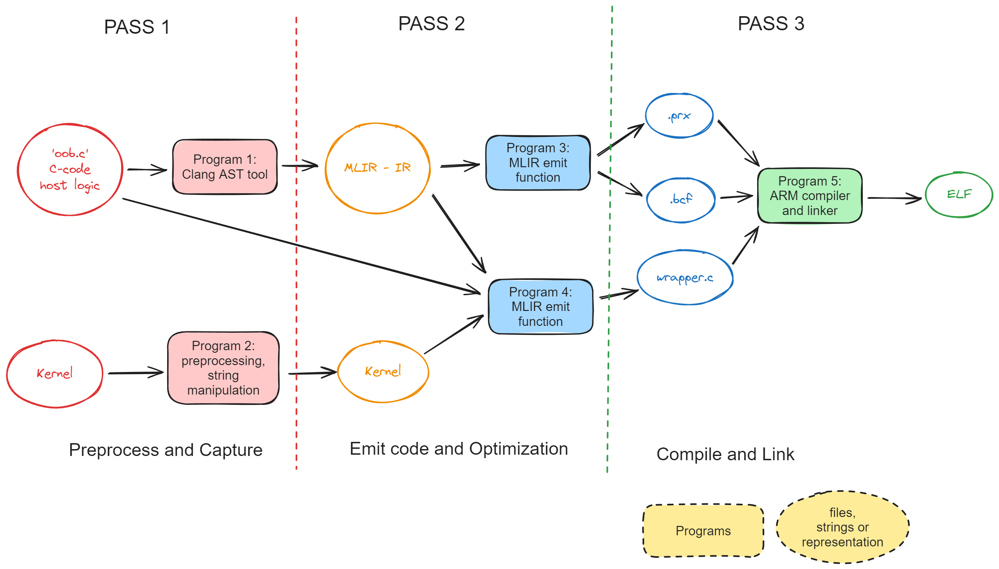

# MLIR FRONT

## Introduction
This program tests and implements the Aie Dialect, its types and operation. It uses Antlr Frontend and MLIR dependency to print and parse the mlir File.

## Build Steps
- Create a build directory and move into it.
```
mkdir build
cd build
```
- Run the Cmake command to generate the make files.
```
cmake ..
```
- Make the binary from make files
```
make -j32
```
- This generates the binary 
```
mlirtest
```

## Usage Steps.
To run the binary use the following command:
```
./mlirtest -e -p ../mlir_files/
```
The options are:
- `-e` for executing the antlr parsers and emitting an MLIR module dump
- `-p <path to the testfiles mentioned in AieFrontEndtTest.cc>` for testing the parser and printer in Aie Dialect.
- `-t <path to a mlir file>` It traverses the all the operations recursively in the ir represented by mlir file.
- `-w <path to a mlir file>` It generates the prototype wrapper.cc and aieml.bcf file (currently only supports one argument and one result, based on loadkernel api)


Example of each command:
- For `-e`, prints various dumps implemented.
```
./mlirtest -e
```

- For `-p`, tests printer and parsers for the test files
```
./mlirtest -p ../mlir_files/
```

- For `-w`, generates wrapper and linker config file
```
./mlirtest -w ../mlir_files/kernel_wrapper.mlir
```

- For `-t`, traverses operations in mlir file and print some information
```
./mlirtest -t ../mlir_files/kernel_wrapper.mlir
```

You can give these options in anyorder and any count.

## Documentation of Feature implemented

Copying the Design file details:



## Introduction
The goal of Acompiler is to give user a simple programming model to write the kernel code and run it on AI Engine. The user should mainly provide the kernel source code and basic load API, the Acompiler should compile this code to single executable elf by capturing, optimizing and emitting code that can be automated and convert it into a single executable file.

Advantages:
- Built on top of MLIR : Allows for modular and quick implementation of optimization logic.
- Automates certain API calls: Makes the user code simple.
- No dependency on aiecompiler: Allows for faster prototyping and testing.

Tools used:
- Clang Frontend: AST Traversal.
- MLIR: For capturing, optimizing and emitting the wrapper code.
- AIELC: (Chess compiler + Arm compiler including linkers)

The above design for Acompiler is a multi-pass solution (3-pass solution).

## Pass 1
The main functionality of the pass is preprocessing of input files and capturing the needed information in a MLIR representation. This is done by two programs currently (Program 1 and Program 2).


**Note**: Currently the prototyping of capturing MLIR Types and Values are separate from Clang AST Traversal and is present at: 

### Functionality of Program 1 (Clang Tool):
- Traverse the C logic code using Clang AST. This is accomplished by using Powerful classes like `FrontEndAction` and `RecursiveASTVisitor` by Clang Tool. We can visit each function declaration, calls, definition and capture the information from the Abstract Syntax Tree.
- Capture the Necessary information needed using MLIR Types and Operation and generated an IR.

Code snippet for Clang Frontend Traversal can be found 
Snippet:
```
class FindNamedClassVisitor : public RecursiveASTVisitor<FindNamedClassVisitor> {
public:
	explicit FindNamedClassVisitor(ASTContext *Context) : Context(Context) {}
	bool VisitCXXRecordDecl(CXXRecordDecl *Declaration)
	{
		if(Declaration->getQualifiedNameAsString() == "n::m::C") {
			FullSourceLoc FullLocation = Context->getFullLoc(Declaration->getBeginLoc());
			if(FullLocation.isValid()){
				llvm::outs() << "Found decl at :" << FullLocation.getSpellingLineNumber()
					<< FullLocation.getSpellingColumnNumber() << "\n";
			}
			
		}
		return true;
	}
private:
	ASTContext *Context;
};
```

Emiting MLIR Structures
Snippet:
```
void CreateWindowOperation(int arg_dir, int arg_size, long arg_pingaddr, long arg_pongaddr, 
	int arg_pinglockid, int arg_ponglockid)
{
	mlir::MLIRContext context;
	context.getOrLoadDialect<AieADialect>();

	ModuleOp module = ModuleOp::create(UnknownLoc::get(&context));
	OpBuilder builder(&context);
	builder.setInsertionPointToEnd(module.getBody());

	auto i32dataType = mlir::IntegerType::get(&context, 32);
	auto i64dataType = mlir::IntegerType::get(&context, 64);

	auto attr_direction = mlir::IntegerAttr::get(i32dataType, arg_dir);
	auto attr_size = mlir::IntegerAttr::get(i32dataType, arg_size);
	auto attr_pingaddr = mlir::IntegerAttr::get(i64dataType, arg_pingaddr);
	auto attr_pongaddr = mlir::IntegerAttr::get(i64dataType, arg_pongaddr);
	auto attr_pinglockid = mlir::IntegerAttr::get(i32dataType, arg_pinglockid);
	auto attr_ponglockid = mlir::IntegerAttr::get(i32dataType, arg_ponglockid);

	mlir::StringAttr nameAttr = builder.getStringAttr("create_window_operation");
	mlir::StringAttr windownameAttr = builder.getStringAttr("mywindow");

	mlir::Type typeinfo = mlir::aie::WindowType::get(&context, arg_dir, arg_size, arg_pingaddr, 
		arg_pongaddr, arg_pinglockid, arg_ponglockid, windownameAttr);
	
	builder.create<CreateWindowOp>(builder.getUnknownLoc(), typeinfo, attr_direction, attr_size, 
		attr_pingaddr, attr_pongaddr, attr_pinglockid, attr_ponglockid, nameAttr);
	module.dump();

}
```


### Functionality of Program 2 (Pre-process):
- Replace the keyword global and automate the stuff which can be a burden to the user.
This is already implmented as python program (more functionality can be added later, `preprocess.py`).
```
import sys
def replace_key_word(file_path):
    try:
        with open(file_path) as f:
            content = f.read()
        new_content = content.replace("__global__", "__attribute__((annotate(\"__global__\")))")
        new_file_path = "{}.pp".format(file_path)
        with open(new_file_path, 'w') as f:
            f.write(new_content)
    except IOError as e:
        print("error\n")
    print("preprocessing done!\n")

def main():
    if len(sys.argv) < 2:
        print("Usage: Python <*.py> <file>")
        sys.exit(1)
    replace_key_word(sys.argv[1])

if __name__ == "__main__":
    main()
```

## Pass 2
This pass mainly optimizes the logic and emits the code which is required by AIELC to compile the ELF. This step is also done by two programs (Program 3 and Program 4). One of the inputs to this Pass is the MLIR representation generated by AST Traversal. We can perform traversal by writing optimization pass tools given by MLIR. (Can be done by separate driver program like `mlir-opt`).


### Functionality of Program 3 (MLIR + Codegen):
- This program traverses the MLIR and captured information is used to generate two files:
	- .bcf (bridge-linker configuration file): which stores information like buffer address and addresses of needed features.
	- .prx (project config files): which can store compilation options, processor architecture (`me` in our case).

Traversal on MLIR (Snippet):
```
void TraverseMLIR(std::string file_path){
	mlir::MLIRContext context;
	llvm::SourceMgr sourceMgr;
	context.getOrLoadDialect<AieADialect>();

	llvm::ErrorOr<std::unique_ptr<llvm::MemoryBuffer>> fileOrErr = 
		llvm::MemoryBuffer::getFile(file_path.c_str());

	if (auto err = fileOrErr.getError()) {
		llvm::errs() << "Error when reading" << file_path << err.message() << "\n";
		return;
	}

	sourceMgr.AddNewSourceBuffer(std::move(*fileOrErr), llvm::SMLoc());
	auto module = mlir::parseSourceFile(sourceMgr, &context);
	if (!module) {
		llvm::errs() << "Error when parsing input.mlir\n";
		return;
	}

	mlir::Operation *op = module.get();
	op->walk([&](mlir::Operation *op){
		llvm::outs() << "visiting op: '" << op->getName() << "' with "
			<< op->getNumOperands() << " operands and "
			<< op->getNumResults() << " results\n";
	});

	return;
}
```


#### Prototype for the Traversal and Emit Logic:
One of the main steps in this step is to travers the IR using functionalities in MLIR and then read the captured values for our Custom Types defined.

#### References:
- Understanding the IR Structure: [here](https://mlir.llvm.org/docs/Tutorials/UnderstandingTheIRStructure/)

- Graph Rewrite: [here](https://mlir.llvm.org/docs/Tutorials/QuickstartRewrites/)

- Pass writing in MLIR: [here](https://www.jeremykun.com/2023/08/10/mlir-writing-our-first-pass/)

### Functionality of Program 4 (MLIR + Codegen):
- This program Identifies all the placeholder API's (which we expose to user to hide the core logic to write the wrapper code) and removes them and generates actual API's and code to create the final wrapper code. This is done by removing all the placeholder API and generate actual API's using optimized values from MLIR.

Snippet: 
```
	auto WrapperGetMainFunction = [&](){
		std::string code = "int main(void){\n";
		// Init Windows
		for(auto kerneldet: kernel_details){
			for(int i=0; i<kerneldet.num_input; i++){
				code += "  " + kerneldet.win_input_name[i] + "[1];\n";
				code += "  window_init("+ kerneldet.win_input_name[i] +", 1, "+ 
				kerneldet.input_buffer_name[i] +", BUF_SZ, BUF_SZ);\n";
			}
			for(int i=0; i<kerneldet.num_output; i++){
				code += "  " + kerneldet.win_result_name[i] + "[1];\n";

				code += "  window_init("+ kerneldet.win_result_name[i] +", 1, "+ 
					kerneldet.result_buffer_name[i] +", BUF_SZ, BUF_SZ);\n";
			}
		}
		code += "\n";

		// Get ASync Windows
		for(auto kerneldet: kernel_details){
			for(int i=0; i<kerneldet.num_input; i++){
				code += "  input_window_int32 * async_input_" + kerneldet.win_input_name[i] + " = " +
					"(get_input_async_window_int32("+kerneldet.win_input_name[i]+"));\n";
			}
			for(int i=0; i<kerneldet.num_output; i++){				
				code += "  output_window_int32 * async_output_" + kerneldet.win_result_name[i] + " = " +
					"(get_output_async_window_int32("+kerneldet.win_result_name[i]+"));\n";
			}
		}
		code += "\n";

		// Call the Kernels
		for(auto kerneldet: kernel_details){
			// TODO: all the logic is currently written for 2 arguments
			// have to change this based on Variadic information captured by MLIR
			// iterate throught the window type in MLIR and determine if it is 
			// input window or output window and then call the kernel accordingly
			// in the same order.
			int cnt_input = 0;
			int cnt_output = 0;

			// Try to format with new line to make it pretty incase there are large
			// number of windows.
			code += "  CALL_KERNEL(FUNC_NAME";
			for(int i=0; i<kerneldet.window_direction.size(); i++){
				if(kerneldet.window_direction[i]){
					code += ", async_output_" + kerneldet.win_result_name[cnt_output++];
				}else{
					code += ", async_input_" + kerneldet.win_input_name[cnt_input++];
				}
			}

			code += ");\n";
		}
		code += "\n";

		code += "  chess_memory_fence();\n";
		code += "  done();\n";
		code += "  return 0;\n";
		code += "}";

		return code;
	};
```

## Pass 3
This pass resembles the AIELC compilation process. This is represented as one program (Program 5). This already implemented at AIELC codebase.


# Research Survey
This section focuses on my research that can utilize the current Acompiler system design. This mainly involves hybrid programming, multiple language support and optimization that can be done.

## Multiple language Support.

<p align="center">Copyright&copy; 2025 Advanced Micro Devices, Inc</p>